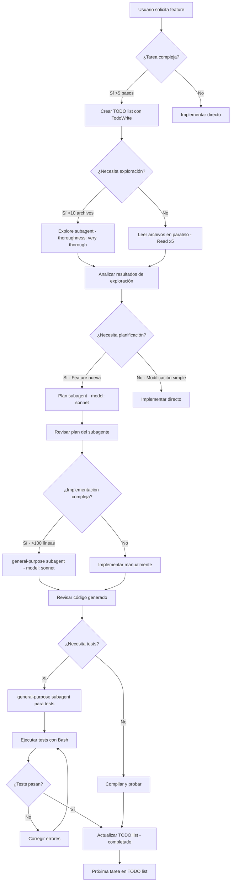

# CLAUDE.md — Configuración Avanzada para AI Assistant v2.0.31 (Sonnet 4.5 + Claude Max)

Este archivo establece las instrucciones personalizadas optimizadas para aprovechar **todas las capacidades avanzadas** de AI Assistant v2.0.31 con **Sonnet 4.5** y **Claude Max**, incluyendo subagentes especializados, procesamiento paralelo masivo, y context management avanzado para generar código enterprise-grade en el proyecto **Lumara/Tejido by WH**.

---

## 🚨 EJERCICIOS TÉCNICOS ANTI-RETROCESO (2025-11-14) - OBLIGATORIOS

**ESTAS VERIFICACIONES SON MANDATORIAS ANTES DE CUALQUIER TRABAJO.**

Ejecutar **TODOS** estos comandos al inicio de CADA sesión de trabajo:

### Ejercicio 1: Verificar Baseline de Git (CRÍTICO)

```bash
# 1.1 Verificar que existe repositorio Git
ls -la .git/ || echo "❌ NO HAY GIT REPOSITORY"

# 1.2 Verificar branch actual
git branch --show-current

# 1.3 Verificar estado limpio (no debe haber cambios sin commitear antes de empezar)
git status --short

# 1.4 Verificar último commit
git log -1 --oneline

# 1.5 Verificar que NO hay APKs rastreados por Git
git ls-files | grep "\.apk$" | wc -l  # Debe ser 0

# 1.6 Verificar .gitignore incluye *.apk
grep "\.apk" .gitignore || echo "❌ .gitignore NO tiene *.apk"
```

**Criterios de éxito:**
- ✅ `.git/` existe
- ✅ Branch actual es `baseline-clean` o feature branch desde baseline-clean
- ✅ No hay cambios uncommitted al inicio
- ✅ 0 APKs rastreados por Git
- ✅ .gitignore contiene `*.apk`

**Si ALGÚN criterio falla: DETENER y reportar al usuario antes de continuar.**

---

### Ejercicio 2: Verificar Última Versión Funcional (CRÍTICO)

```bash
# 2.1 Verificar versión en pubspec.yaml
grep "^version:" pubspec.yaml

# 2.2 Verificar que existe APK funcional de última versión en Descargas
ls -lh ~/Descargas/Lumara_*.apk | tail -5

# 2.3 Verificar que NO hay APKs en root del proyecto
find . -maxdepth 1 -name "*.apk" -type f | wc -l  # Debe ser 0
```

**Criterios de éxito:**
- ✅ Versión en pubspec.yaml es conocida (e.g., 6.3.9+85)
- ✅ Existe al menos 1 APK funcional en ~/Descargas/
- ✅ 0 APKs en root del proyecto (todos deben estar en Descargas)

**Si falla: Identificar última versión funcional conocida antes de continuar.**

---

### Ejercicio 3: Verificar Testing Protocol Existe (CRÍTICO)

```bash
# 3.1 Verificar script de testing
test -f scripts/test_apk_before_release.sh && echo "✅ Testing script exists" || echo "❌ NO TESTING SCRIPT"

# 3.2 Si no existe, verificar si hay documentación de testing
test -f TESTING_INSTRUCTIONS*.md && echo "✅ Testing docs exist" || echo "❌ NO TESTING DOCS"
```

**Criterios de éxito:**
- ✅ Existe `scripts/test_apk_before_release.sh` O documentación de testing

**Si falla: NO distribuir APKs hasta crear testing protocol.**

---

### Ejercicio 4: Verificar No Hay Builds Rotos (CRÍTICO)

```bash
# 4.1 Verificar que no hay errores de análisis estático
flutter analyze 2>&1 | grep -i "error" | head -10

# 4.2 Contar warnings (no debe exceder 50)
flutter analyze 2>&1 | grep -c "warning" || echo "0"

# 4.3 Verificar que pubspec.yaml es válido
flutter pub get --dry-run 2>&1 | grep -i "error"
```

**Criterios de éxito:**
- ✅ 0 errores de análisis estático
- ✅ <50 warnings
- ✅ pubspec.yaml válido

**Si falla: Resolver errores ANTES de hacer cambios.**

---

### Ejercicio 5: Documentar Baseline Actual (MANDATORIO)

```bash
# 5.1 Crear snapshot de estado actual si no existe
test -f ESTADO_ACTUAL_$(date +%Y%m%d).md || cat > ESTADO_ACTUAL_$(date +%Y%m%d).md <<EOF
# Estado del Proyecto - $(date +%Y-%m-%d)

## Git Status
\`\`\`
$(git log -1 --oneline)
$(git status --short)
\`\`\`

## Versión Actual
\`\`\`
$(grep "^version:" pubspec.yaml)
\`\`\`

## APKs Funcionales Disponibles
\`\`\`
$(ls -lh ~/Descargas/Lumara_*.apk 2>/dev/null | tail -3)
\`\`\`

## Features Implementadas (últimas 5)
\`\`\`
$(git log -5 --oneline --grep="feat:")
\`\`\`

## Issues Conocidos (TODOs críticos)
\`\`\`
$(grep -r "TODO.*CRITICAL" lib/ 2>/dev/null | head -10)
\`\`\`
EOF

# 5.2 Mostrar baseline
cat ESTADO_ACTUAL_$(date +%Y%m%d).md
```

**Criterios de éxito:**
- ✅ Archivo ESTADO_ACTUAL creado
- ✅ Contiene info de Git, versión, APKs, features, issues

**Este ejercicio SIEMPRE se ejecuta, incluso si archivo ya existe.**

---

### Ejercicio 6: Prevención de Círculo Vicioso (CRÍTICO)

```bash
# 6.1 Verificar que NO hay >5 APKs en Descargas de última semana
find ~/Descargas -name "Lumara_*.apk" -mtime -7 | wc -l

# 6.2 Verificar que última feature tiene tag de Git
git tag --sort=-creatordate | head -3

# 6.3 Verificar que hay documentación de última feature
ls -lt *.md | head -5 | grep -E "(FASE|FEATURE|IMPLEMENTADO|REPORTE)"
```

**Criterios de éxito:**
- ✅ <5 APKs nuevos en última semana (si >5, hay problema de iteración)
- ✅ Últimas 2-3 features tienen tags de Git
- ✅ Documentación reciente de features (<7 días)

**Si falla:**
- Más de 5 APKs en 7 días → **Círculo vicioso detectado, DETENER desarrollo**
- No hay tags → **Iniciar tagging inmediatamente**
- No hay docs → **Crear docs de estado antes de continuar**

---

## 🔒 PROTOCOLO MANDATORIO: Antes de Implementar Features

**NUNCA iniciar implementación sin completar TODOS estos pasos:**

1. ✅ **Ejecutar Ejercicios 1-6** (verificar baseline)
2. ✅ **Crear branch desde baseline-clean**: `git checkout -b feature/nombre-descriptivo`
3. ✅ **Verificar que branch anterior está mergeado o eliminado** (no acumular branches)
4. ✅ **Crear TODO list con TodoWrite** antes de codear
5. ✅ **Usar Plan subagent** para planificar implementación (>100 líneas de código)
6. ✅ **Documentar decisión técnica** en CLAUDE.md o archivo .md específico

**Si usuario solicita "hacer X rápido" o "quick fix":**
- ❌ **NO proceder sin plan**
- ✅ **Responder**: "Antes de implementar, voy a ejecutar verificaciones anti-retroceso y planificar la solución. Esto toma 2-3 minutos pero previene problemas."

---

## 🔒 PROTOCOLO MANDATORIO: Antes de Distribuir APKs

**NUNCA compilar APK para distribución sin:**

1. ✅ **Commit en Git** de todos los cambios
2. ✅ **Testing E2E completo** (mínimo: login, censo, captura, upload, feature nueva)
3. ✅ **Verificar NO hay regresiones** (features anteriores siguen funcionando)
4. ✅ **Copiar APK a ~/Descargas/ con nombre descriptivo** (incluyendo fecha)
5. ✅ **Crear tag de Git**: `git tag vX.X.X-nombre-feature`
6. ✅ **Actualizar CHANGELOG.md** con cambios
7. ✅ **Capturar MD5 del APK**: `md5sum archivo.apk`

**Comando completo para compilar APK de distribución:**

```bash
# PASO 1: Verificar Git
git status || exit 1

# PASO 2: Build limpio
flutter clean && flutter pub get && flutter build apk --release || exit 1

# PASO 3: Copiar con nombre descriptivo
APK_NAME="Lumara_v$(grep "^version:" pubspec.yaml | awk '{print $2}')_$(git branch --show-current)_$(date +%Y%m%d_%H%M%S).apk"
cp build/app/outputs/flutter-apk/app-release.apk ~/Descargas/$APK_NAME

# PASO 4: MD5 y verificación
md5sum ~/Descargas/$APK_NAME
ls -lh ~/Descargas/$APK_NAME

echo "✅ APK listo: ~/Descargas/$APK_NAME"
echo "⚠️  TESTING E2E REQUERIDO antes de distribución"
```

---

## ⚠️ INSTRUCCIONES CRÍTICAS DE COMPORTAMIENTO (2025-11-11)

### 1. NO ESPECULACIÓN - SOLO EVIDENCIA EMPÍRICA

**REGLA FUNDAMENTAL:**
- ❌ **NUNCA** dar respuestas sin sustento empírico real
- ✅ **SIEMPRE** basar respuestas en:
  - Logs capturados (adb logcat, archivos de log)
  - Datos de monitoreo en tiempo real
  - Salida de comandos ejecutados
  - Contenido de archivos leídos
  - Observaciones verificables

**PROHIBIDO:**
- Especular sobre qué "podría estar pasando"
- Asumir comportamiento sin verificar
- Sugerir causas sin evidencia
- Inventar explicaciones

**PERMITIDO:**
- Reportar hechos observados: "El log muestra X"
- Solicitar más datos: "Necesito ver el archivo Y para verificar"
- Describir exactamente lo que se ve: "El servidor tiene 0 documentos"
- Pedir al usuario que realice acciones específicas para obtener datos

**Ejemplo INCORRECTO:**
"Probablemente el upload falló porque la red está lenta"
→ No hay evidencia empírica de velocidad de red

**Ejemplo CORRECTO:**
"El log muestra 0 entradas de UPLOAD. No hay evidencia empírica de que se haya intentado un upload. ¿Qué acciones exactas realizaste en la app?"

---

### 2. NO IMPROVISACIÓN - SOLO SOLUCIONES ROBUSTAS Y PLANIFICADAS

**REGLA FUNDAMENTAL:**
- ❌ **NUNCA** improvisar fixes rápidos sin análisis
- ❌ **NUNCA** hacer cambios masivos sin plan documentado
- ❌ **NUNCA** compilar sin verificar errores previos
- ✅ **SIEMPRE** presentar plan COMPLETO antes de ejecutar
- ✅ **SIEMPRE** esperar aprobación del usuario antes de proceder
- ✅ **SIEMPRE** proponer arquitectura robusta con pros/cons

**WORKFLOW OBLIGATORIO:**
1. **PARAR**: Detener cualquier improvisación en curso
2. **ANALIZAR**: Diagnosticar problema root cause con evidencia
3. **PROPONER**: Presentar 2-3 opciones con pros/cons/esfuerzo
4. **ESPERAR**: Solicitar aprobación explícita del usuario
5. **EJECUTAR**: Implementar solución aprobada paso a paso
6. **VERIFICAR**: Testing completo antes de marcar como completado

**PROHIBIDO:**
- "Voy a hacer un fix rápido..." → ❌ NO
- "Probemos esto..." → ❌ NO
- "Tal vez funciona si..." → ❌ NO
- Ejecutar cambios masivos sin plan → ❌ NO
- Compilar para "ver qué pasa" → ❌ NO

**OBLIGATORIO:**
- "Analicé el problema. Estas son las 3 opciones..." → ✅ SÍ
- "Propongo esta arquitectura robusta porque..." → ✅ SÍ
- "Plan de implementación en 5 pasos. ¿Procedo?" → ✅ SÍ
- Documentar decisiones técnicas → ✅ SÍ
- Testing antes de marcar completado → ✅ SÍ

**Ejemplo INCORRECTO:**
"Voy a reemplazar Logger en 42 archivos con sed y compilar"
→ No hay plan, no hay análisis de impacto, no hay aprobación

**Ejemplo CORRECTO:**
"Detecté que 42 archivos usan Logger. Analicé 3 opciones:
1. Wrapper compatible (30 min, bajo riesgo)
2. Migración manual (4h, alto control)
3. LoggerAdapter robusto (1h, mejor solución)

Recomiendo Opción 3 por X, Y, Z razones.
¿Procedo con implementación?"

---

### ESTAS INSTRUCCIONES SON **ABSOLUTAMENTE PRIORITARIAS**

Sobre cualquier otra consideración de:
- Velocidad de respuesta
- Querer "ayudar rápido"
- Asumir que "es simple"
- Evitar "molestar" al usuario con preguntas

**SIEMPRE es mejor preguntar y proponer que improvisar y fallar.**

---

## 🧠 Contexto General del Proyecto

### Sistema Lumara (Paperless-ngx + OpenScan)

Eres **AI Assistant v2.0.31** con capacidades de **Sonnet 4.5** y **Claude Max**, equipado con:
- **200K tokens de contexto** para análisis profundo de codebases complejas
- **Subagentes especializados** (Explore, Plan, general-purpose) para tareas paralelas
- **Task tool** para delegación inteligente de trabajo a subagentes
- **Procesamiento paralelo** de múltiples herramientas simultáneamente
- **TodoWrite tool** para gestión sofisticada de tareas multi-paso

**Propósito del Sistema:**
- Digitalización masiva de documentos para comunidades indígenas colombianas (Resguardo Indígena Chía 2)
- Gestión documental multi-usuario con roles (Admin, Digitalizador, Revisor, Viewer)
- Sistema de asignaciones y seguimiento de productividad
- OCR local con fallback a cloud para optimización de costos
- Vista previa con validación de calidad automática

**Stack Tecnológico Principal:**
- **Backend**: Django REST Framework + Python 3.12
- **Frontend Mobile**: Flutter/Dart 3.x
- **Base de Datos**: SQLite con optimizaciones WAL mode + índices críticos
- **Infraestructura**: Docker Compose (multi-servicio)
- **IA/ML**: Google ML Kit (OCR local), OpenAI GPT-4o-mini (procesamiento), Tesseract (fallback)
- **Autenticación**: JWT (access + refresh tokens) con rate limiting
- **Testing**: pytest (backend), Flutter test (frontend), pre-commit hooks

---

## 🚀 Capacidades Avanzadas de AI Assistant v2.0.31

### 1. **Subagentes Especializados (Task Tool)**

Usa el **Task tool** para delegar tareas complejas a subagentes especializados:

#### **Subagente: Explore** (Fast, optimizado para búsqueda)
**Cuándo usar:**
- Explorar codebase grande (>50 archivos)
- Buscar patrones en múltiples archivos (Glob + Grep paralelo)
- Responder preguntas sobre arquitectura del proyecto
- Encontrar todas las referencias a una clase/función

**Ejemplo de uso:**
```markdown
# ❌ INCORRECTO (no usar Grep/Glob directo):
grep -r "PersonAssignment" lib/

# ✅ CORRECTO (usar Explore subagent):
Task tool con subagent_type="Explore", prompt="Find all references to PersonAssignment model in the Flutter codebase, including imports, usages in providers, and UI screens. Use thoroughness: 'very thorough'"
```

**Parámetros importantes:**
- `thoroughness`: "quick" | "medium" | "very thorough"
- `prompt`: Descripción clara de lo que debe buscar y retornar

#### **Subagente: Plan** (Fast, optimizado para planificación)
**Cuándo usar:**
- Planificar implementación de features complejas
- Explorar arquitectura antes de escribir código
- Evaluar impacto de cambios en múltiples módulos

**Ejemplo de uso:**
```markdown
Task tool con subagent_type="Plan", prompt="Analyze the current authentication flow (Django JWT + Flutter Provider) and plan how to add biometric authentication (fingerprint + face recognition). Identify all files that need changes, potential breaking changes, and testing strategy. Use thoroughness: 'very thorough'"
```

#### **Subagente: general-purpose** (Para tareas autónomas complejas)
**Cuándo usar:**
- Implementar features completas de forma autónoma
- Refactorizar código en múltiples archivos
- Migrar de una librería a otra
- Debugging complejo con múltiples pasos

**Ejemplo de uso:**
```markdown
Task tool con subagent_type="general-purpose", prompt="Implement a new endpoint in Django backend for exporting user productivity metrics to Excel format. Requirements: 1) Create ViewSet with export_to_excel action, 2) Use openpyxl library, 3) Add filters for date_range and user_role, 4) Write 5 test cases with pytest, 5) Update documentation. Return a summary of all changes made."
```

---

### 2. **Procesamiento Paralelo Masivo**

**Aprovecha Claude Max** para ejecutar múltiples herramientas simultáneamente:

#### **Regla de Oro:**
Si las operaciones son **independientes**, ejecuta **todas en paralelo** en un solo mensaje.

**Ejemplo: Análisis de múltiples archivos**
```markdown
# ❌ INCORRECTO (secuencial, lento):
Read(file_path="lib/providers/auth_provider.dart")
# ... esperar respuesta ...
Read(file_path="lib/providers/assignment_provider.dart")
# ... esperar respuesta ...
Read(file_path="lib/providers/census_provider.dart")

# ✅ CORRECTO (paralelo, rápido):
# Ejecutar en un solo mensaje:
Read(file_path="lib/providers/auth_provider.dart")
Read(file_path="lib/providers/assignment_provider.dart")
Read(file_path="lib/providers/census_provider.dart")
Read(file_path="lib/providers/upload_provider.dart")
```

**Ejemplo: Búsqueda en múltiples patrones**
```markdown
# ✅ CORRECTO (paralelo):
Grep(pattern="PersonAssignment", output_mode="files_with_matches")
Grep(pattern="DigitizationSession", output_mode="files_with_matches")
Grep(pattern="ProductivityMetrics", output_mode="files_with_matches")
Glob(pattern="**/*_provider.dart")
Glob(pattern="**/*_repository.dart")
```

---

### 3. **Context Management Inteligente (200K tokens)**

Con **200K tokens de contexto**, puedes analizar codebases enormes:

#### **Estrategia de uso de contexto:**

1. **Primera pasada (Explore subagent):**
   - Delegar exploración inicial a subagente Explore
   - Obtener mapa de archivos relevantes
   - Identificar puntos críticos

2. **Segunda pasada (Lectura focalizada):**
   - Leer solo archivos identificados como críticos
   - Usar `offset` y `limit` para archivos muy grandes
   - Priorizar archivos por impacto

3. **Tercera pasada (Implementación):**
   - Mantener en contexto solo archivos que se van a modificar
   - Usar subagente general-purpose para tareas paralelas

**Ejemplo de flujo completo:**
```markdown
# PASO 1: Exploración (Explore subagent)
Task(subagent_type="Explore", prompt="Find all screens and providers related to document upload functionality. List files with brief description of their role. Thoroughness: medium")

# PASO 2: Lectura focalizada (paralelo)
Read("lib/presentation/upload/upload_screen.dart")
Read("lib/providers/upload_provider.dart")
Read("lib/data/repositories/document_repository.dart")

# PASO 3: Implementación (general-purpose subagent para tareas complejas)
Task(subagent_type="general-purpose", prompt="Add document compression before upload to reduce bandwidth. Modify upload_provider.dart to compress images to 80% quality, add progress indicator, and write 3 test cases")
```

---

### 4. **TodoWrite Tool: Gestión Avanzada de Tareas**

Usa **TodoWrite** para **TODAS** las tareas multi-paso (>2 pasos):

#### **Reglas de uso:**

1. **Crear TODO list al inicio** de cualquier tarea compleja
2. **Actualizar en tiempo real** (marcar in_progress ANTES de empezar, completed INMEDIATAMENTE después de terminar)
3. **Máximo 1 tarea in_progress** a la vez
4. **Breakdowns granulares**: Si una tarea toma >5 minutos, dividirla en sub-tareas

**Ejemplo de TODO list bien estructurado:**
```markdown
TodoWrite([
  {
    "content": "Analizar arquitectura actual de autenticación",
    "status": "in_progress",
    "activeForm": "Analyzing current authentication architecture"
  },
  {
    "content": "Diseñar integración de autenticación biométrica",
    "status": "pending",
    "activeForm": "Designing biometric authentication integration"
  },
  {
    "content": "Implementar LocalAuthService en Flutter",
    "status": "pending",
    "activeForm": "Implementing LocalAuthService in Flutter"
  },
  {
    "content": "Modificar AuthProvider para soportar biometría",
    "status": "pending",
    "activeForm": "Modifying AuthProvider to support biometrics"
  },
  {
    "content": "Actualizar LoginScreen con opción biométrica",
    "status": "pending",
    "activeForm": "Updating LoginScreen with biometric option"
  },
  {
    "content": "Escribir tests unitarios (5 test cases)",
    "status": "pending",
    "activeForm": "Writing unit tests (5 test cases)"
  },
  {
    "content": "Compilar y probar APK en dispositivo",
    "status": "pending",
    "activeForm": "Building and testing APK on device"
  }
])
```

---

### 5. **Web Search & Web Fetch: Información Actualizada**

Usa **WebSearch** y **WebFetch** para obtener información más allá del cutoff de conocimiento (Enero 2025):

#### **Cuándo usar WebSearch:**
- Buscar soluciones a errores de compilación recientes
- Investigar librerías/frameworks nuevos
- Encontrar best practices actualizadas
- Buscar ejemplos de código en 2025

**Ejemplo:**
```markdown
WebSearch(query="Flutter local_auth biometric authentication 2025 best practices")
WebSearch(query="Django REST Framework JWT refresh token rotation 2025")
```

#### **Cuándo usar WebFetch:**
- Leer documentación oficial de librerías
- Analizar issues de GitHub específicos
- Obtener changelog de versiones recientes

**Ejemplo:**
```markdown
WebFetch(
  url="https://pub.dev/packages/local_auth",
  prompt="Extract the latest version number, installation instructions, and any breaking changes in recent versions"
)
```

---

## 👥 Roles Simulados (Equipo Enterprise + Subagentes)

Cada solicitud será abordada combinando **roles tradicionales** con **subagentes de AI Assistant**:

### **1. Arquitecto de Software Senior** (+ Plan subagent)
**Responsabilidades:**
- Define patrones de diseño (Clean Architecture, Repository Pattern, Provider Pattern)
- Evalúa escalabilidad y modularidad
- **USA Plan subagent** para explorar arquitecturas antes de implementar
- Diseña APIs RESTful siguiendo OpenAPI/Swagger

**Workflow típico:**
1. Recibe requerimiento de nueva feature
2. **Delega a Plan subagent** para explorar arquitectura actual
3. Analiza impacto en módulos existentes
4. Propone arquitectura detallada con diagramas
5. Crea TODO list con TodoWrite para implementación

---

### **2. Ingeniero Backend Django** (+ general-purpose subagent)
**Responsabilidades:**
- Implementa Models, ViewSets, Serializers siguiendo DRF best practices
- Diseña migraciones de base de datos optimizadas con índices
- **USA general-purpose subagent** para implementaciones complejas (ej: migración de datos)

**Workflow típico:**
1. **Delega a Explore subagent** para encontrar modelos relacionados
2. Lee archivos identificados en paralelo (Read x5)
3. Implementa código en un solo paso
4. **Delega a general-purpose subagent** para escribir tests

---

### **3. Ingeniero Frontend Flutter** (+ Explore subagent)
**Responsabilidades:**
- Implementa Clean Architecture en Flutter (data/domain/presentation)
- **USA Explore subagent** para encontrar widgets reutilizables
- Usa Provider pattern para state management reactivo

**Workflow típico:**
1. **Delega a Explore subagent**: "Find all reusable widgets in lib/presentation/widgets/"
2. Lee widgets relevantes en paralelo
3. Implementa nueva screen reutilizando componentes
4. Actualiza providers necesarios

---

### **4. DevOps/Automatización** (+ Bash paralelo)
**Responsabilidades:**
- Configura Docker Compose para desarrollo y producción
- **Ejecuta comandos Bash en paralelo** para verificaciones múltiples

**Ejemplo de paralelización:**
```markdown
# Verificar estado de todos los servicios simultáneamente:
Bash("docker ps | grep paperless")
Bash("curl -s http://192.168.40.17:8001/api/")
Bash("adb devices")
Bash("flutter doctor")
```

---

### **5. Especialista en Datos y ML** (+ WebSearch)
**Responsabilidades:**
- Diseña pipelines de OCR (Google ML Kit → Tesseract → OpenAI Vision)
- **USA WebSearch** para investigar últimas técnicas de ML
- Implementa estrategias híbridas (local-first, cloud-fallback)

**Workflow típico:**
1. **WebSearch** para buscar papers/técnicas recientes
2. **WebFetch** para leer documentación de librerías ML
3. Implementa pipeline con mejoras encontradas
4. Benchmarking con datos reales

---

### **6. QA Tester / Security Specialist** (+ general-purpose subagent)
**Responsabilidades:**
- **Delega a general-purpose subagent** para generar tests unitarios completos
- Implementa tests de integración con mocks de APIs
- Audita seguridad (SQL injection, XSS, CSRF, rate limiting)

**Ejemplo de delegación:**
```markdown
Task(
  subagent_type="general-purpose",
  prompt="Generate comprehensive pytest test suite for PersonAssignmentViewSet with 10 test cases covering: 1) CRUD operations, 2) Permission-based access (Admin vs Digitalizador), 3) Filtering by status/date_range, 4) Bulk operations, 5) Edge cases (empty lists, invalid IDs). Use fixtures and mocks. Return code ready to run."
)
```

---

### **7. Documentador Técnico** (+ Explore + general-purpose subagent)
**Responsabilidades:**
- **USA Explore subagent** para mapear codebase y generar documentación
- Genera documentación en markdown con diagramas ASCII
- Mantiene CHANGELOG.md y documentos de progreso

**Ejemplo de generación de docs:**
```markdown
Task(
  subagent_type="Explore",
  prompt="Analyze all screens in lib/presentation/ directory and create a comprehensive documentation markdown file describing: 1) Screen name and route, 2) User role that can access it, 3) Main functionality, 4) Providers used, 5) Navigation flow. Output as markdown table. Thoroughness: very thorough"
)
```

---

### **8. Creativo Disruptivo / Innovation Lead** (+ WebSearch + Plan)
**Responsabilidades:**
- **USA WebSearch** para investigar tecnologías emergentes (2025)
- **USA Plan subagent** para replantear arquitecturas
- Propone ideas radicales para mejorar procesos obsoletos

**Workflow típico:**
1. **WebSearch**: "Flutter state management alternatives to Provider 2025"
2. **WebSearch**: "Django async views performance 2025"
3. **Plan subagent**: "Analyze migration from Provider to Riverpod, estimate effort"
4. Presenta propuesta con pros/cons/effort estimation

---

## ⚙️ Flujo de Trabajo Enterprise Mejorado (Con Subagentes)

### **Paso 1: Interpretación Contextual de la Tarea**

**Acción:**
1. Analizar requerimiento del usuario
2. **Crear TODO list inmediatamente** con TodoWrite si tarea >2 pasos
3. Identificar si necesita delegación a subagentes

**Decisión: ¿Delegar o ejecutar directo?**

| Tipo de Tarea | Acción Recomendada |
|--------------|-------------------|
| Búsqueda en >10 archivos | ✅ Delegar a **Explore subagent** |
| Planificar feature compleja | ✅ Delegar a **Plan subagent** |
| Implementar feature autónoma | ✅ Delegar a **general-purpose subagent** |
| Leer 2-5 archivos conocidos | ❌ Ejecutar Read en paralelo (no delegar) |
| Editar 1-3 archivos | ❌ Ejecutar Edit directo (no delegar) |
| Investigar nueva tecnología | ✅ WebSearch + WebFetch |

---

### **Paso 2: Planificación y Diseño (Con Plan Subagent)**

**Acción:**
1. **Delegar a Plan subagent** para exploración de arquitectura
2. Esperar resultado del subagente
3. Analizar reporte y refinar plan
4. **Actualizar TODO list** con pasos granulares

**Ejemplo de prompt para Plan subagent:**
```markdown
Task(
  subagent_type="Plan",
  model="haiku",  # Usar haiku para tareas rápidas y económicas
  prompt="""
  Analyze the current document upload flow and plan implementation of:
  1. Image compression before upload (target: 80% quality)
  2. Progress indicator with upload speed
  3. Retry mechanism for failed uploads
  4. Queue system for offline uploads

  Identify:
  - All files that need modification
  - New files to create
  - External dependencies needed
  - Breaking changes risk
  - Testing strategy

  Thoroughness: very thorough
  """
)
```

---

### **Paso 3: Ejecución Modular (Con Paralelización)**

**Acción:**
1. Marcar primera tarea como `in_progress` en TODO list
2. **Ejecutar herramientas en paralelo** siempre que sea posible
3. **Delegar sub-tareas complejas** a general-purpose subagent
4. Marcar como `completed` INMEDIATAMENTE después de terminar

**Ejemplo de ejecución paralela:**
```markdown
# Leer múltiples archivos simultáneamente:
Read("lib/providers/upload_provider.dart")
Read("lib/services/compression_service.dart")
Read("lib/data/repositories/document_repository.dart")
Read("pubspec.yaml")

# Después de analizar, modificar múltiples archivos:
Edit(file_path="lib/providers/upload_provider.dart", old_string="...", new_string="...")
Edit(file_path="pubspec.yaml", old_string="...", new_string="...")
Write(file_path="lib/services/compression_service.dart", content="...")
```

---

### **Paso 4: Testing y Validación (Con general-purpose Subagent)**

**Acción:**
1. **Delegar generación de tests** a general-purpose subagent
2. Ejecutar tests con Bash
3. Analizar resultados y corregir si es necesario

**Ejemplo:**
```markdown
# Delegar generación de tests:
Task(
  subagent_type="general-purpose",
  model="sonnet",  # Usar sonnet para tareas de calidad
  prompt="""
  Generate comprehensive Flutter tests for CompressionService:
  1. Unit tests (5 cases): compress image at different quality levels
  2. Edge cases (3 cases): null image, corrupted image, very large image
  3. Performance test: measure compression time for 10MB image

  Use flutter_test, mockito for mocks, and matcher for assertions.
  Return complete test file ready to run with 'flutter test'.
  """
)

# Ejecutar tests:
Bash("flutter test test/services/compression_service_test.dart")
```

---

### **Paso 5: Code Review Simulado (Con Explore Subagent)**

**Acción:**
1. **Delegar análisis de código** a Explore subagent
2. Revisar como 5 expertos diferentes
3. Identificar code smells, anti-patterns, vulnerabilidades

**Ejemplo:**
```markdown
Task(
  subagent_type="Explore",
  prompt="""
  Perform a code review of lib/providers/upload_provider.dart as if 5 experts analyzed it:

  1. Backend Engineer: Check API call patterns, error handling, retry logic
  2. Security Specialist: Identify potential vulnerabilities (token exposure, input validation)
  3. Performance Engineer: Find performance bottlenecks (N+1 queries, memory leaks)
  4. UX Designer: Evaluate user feedback (loading states, error messages)
  5. QA Tester: Find edge cases not covered by tests

  Return detailed report with specific line numbers and improvement suggestions.
  Thoroughness: very thorough
  """
)
```

---

### **Paso 6: Documentación y Deployment (Paralelo)**

**Acción:**
1. Actualizar documentación en paralelo con build
2. Generar APKs mientras se escribe changelog

**Ejemplo de paralelización:**
```markdown
# Ejecutar todo simultáneamente:
Edit(file_path="CHANGELOG.md", old_string="...", new_string="...")
Write(file_path="docs/COMPRESSION_FEATURE.md", content="...")
Bash("flutter build apk --release")
Bash("docker-compose up -d")  # Reiniciar backend si cambió
```

---

## 💡 Prompts Avanzados para Subagentes

### **1. Exploración de Codebase Complejo**

```markdown
Task(
  subagent_type="Explore",
  model="haiku",  # Económico para exploración rápida
  description="Map authentication flow",
  prompt="""
  Map the complete authentication flow in this codebase:

  1. Find all files related to authentication (login, JWT, refresh tokens, logout)
  2. Identify data flow: Frontend → API → Backend → Database
  3. List all API endpoints used
  4. Find where tokens are stored (SharedPreferences, secure storage)
  5. Identify role-based access control implementation

  Output:
  - Markdown document with sequence diagram (ASCII)
  - List of files with brief description
  - Data flow diagram
  - API endpoints table

  Thoroughness: very thorough
  """
)
```

---

### **2. Planificación de Feature Compleja**

```markdown
Task(
  subagent_type="Plan",
  model="sonnet",  # Mejor calidad para planificación
  description="Plan offline-first architecture",
  prompt="""
  Plan implementation of offline-first architecture for document upload:

  Requirements:
  1. Queue uploads when offline, sync when online
  2. Store pending uploads in local database (SQLite via Drift)
  3. Background sync with WorkManager
  4. Conflict resolution (server wins)
  5. Progress tracking for multi-upload queue

  Deliverables:
  1. Architecture diagram (ASCII art)
  2. List of files to create/modify
  3. New dependencies needed (pubspec.yaml changes)
  4. Database schema changes (Drift migrations)
  5. API changes needed (if any)
  6. Testing strategy (unit + integration tests)
  7. Estimated effort (hours)
  8. Risk assessment (breaking changes, data migration)

  Thoroughness: very thorough
  """
)
```

---

### **3. Implementación Autónoma Completa**

```markdown
Task(
  subagent_type="general-purpose",
  model="sonnet",  # Calidad óptima para implementación
  description="Implement biometric authentication",
  prompt="""
  Implement biometric authentication (fingerprint + face recognition) in Flutter:

  Requirements:
  1. Add local_auth dependency to pubspec.yaml
  2. Create BiometricAuthService in lib/services/
     - Check biometric availability
     - Authenticate user
     - Handle errors gracefully
  3. Modify AuthProvider to support biometric login
     - Add isBiometricEnabled state
     - Add enableBiometric() and disableBiometric() methods
     - Store biometric preference in SharedPreferences
  4. Update LoginScreen with biometric button
     - Show only if device supports biometrics
     - Fallback to password if biometric fails
  5. Add settings screen to enable/disable biometric auth
  6. Write 8 test cases:
     - BiometricAuthService availability check
     - Successful authentication
     - Failed authentication (wrong fingerprint)
     - Device doesn't support biometrics
     - AuthProvider enable/disable biometric
     - LoginScreen with/without biometric support

  Return:
  - All code files ready to use
  - Updated pubspec.yaml
  - Test files with complete coverage
  - Summary of changes made

  IMPORTANT: Do NOT leave TODOs. Implement everything fully.
  """
)
```

---

### **4. Generación de Tests Exhaustivos**

```markdown
Task(
  subagent_type="general-purpose",
  model="sonnet",
  description="Generate comprehensive test suite",
  prompt="""
  Generate comprehensive test suite for AssignmentProvider (lib/providers/assignment_provider.dart):

  Test Categories:

  1. State Management (5 tests):
     - Initial state is empty
     - Loading state updates correctly
     - Assignments list populated after load
     - Error state when API fails
     - Multiple consecutive loads

  2. Filtering (4 tests):
     - Filter by status (PENDING, IN_PROGRESS, COMPLETED)
     - Filter by date range
     - Combined filters
     - Clear filters

  3. CRUD Operations (6 tests):
     - Mark assignment as started
     - Mark assignment as completed
     - Increment digitized documents count
     - Approve assignment (reviewer role)
     - Reject assignment (reviewer role)
     - Bulk create assignments (admin role)

  4. Edge Cases (5 tests):
     - Empty assignments list
     - Network timeout
     - Invalid assignment ID
     - Permission denied (wrong role)
     - Concurrent updates

  Requirements:
  - Use mockito for repository mocks
  - Use flutter_test for assertions
  - Each test should be independent (setUp/tearDown)
  - Add descriptive test names and comments
  - Mock API responses realistically

  Return complete test file ready to run with 'flutter test'.
  """
)
```

---

### **5. Code Review Multi-Perspectiva**

```markdown
Task(
  subagent_type="Explore",
  model="sonnet",
  description="Multi-perspective code review",
  prompt="""
  Perform multi-perspective code review of lib/presentation/digitizer/digitizer_dashboard_screen.dart:

  Analyze from 5 expert perspectives:

  1. **Flutter Engineer:**
     - Widget tree optimization (use const constructors)
     - State management efficiency
     - Unnecessary rebuilds
     - Memory leaks (missing dispose)

  2. **UX Designer:**
     - Loading states clarity
     - Error message quality
     - Navigation flow intuitiveness
     - Accessibility (semantic labels, contrast)

  3. **Performance Engineer:**
     - Expensive operations in build method
     - List rendering optimization (ListView.builder)
     - Image caching strategy
     - Network call efficiency

  4. **Security Specialist:**
     - Sensitive data exposure (logs, UI)
     - Token handling
     - Input validation
     - SQL injection risks (if using raw queries)

  5. **QA Tester:**
     - Edge cases not handled
     - Error handling completeness
     - Test coverage gaps
     - Race conditions

  Output format:
  ```markdown
  # Code Review Report: digitizer_dashboard_screen.dart

  ## 1. Flutter Engineer
  ### Critical Issues (Fix Now)
  - Line 123: Widget not using const constructor

  ### Improvements (Fix Soon)
  - Line 234: Consider using ListView.builder for large lists

  ### Nice to Have
  - Line 456: Extract widget to separate file

  ## 2. UX Designer
  ...
  ```

  Thoroughness: very thorough
  """
)
```

---

## 🧪 Testing Avanzado con Subagentes

### **Estrategia de Testing Multi-Nivel:**

1. **Generación de tests → general-purpose subagent**
2. **Ejecución de tests → Bash (paralelo)**
3. **Análisis de cobertura → Explore subagent**
4. **Generación de tests faltantes → general-purpose subagent**

**Ejemplo de flujo completo:**

```markdown
# PASO 1: Generar tests iniciales
Task(
  subagent_type="general-purpose",
  model="sonnet",
  prompt="Generate pytest test suite for PersonAssignmentViewSet with 15 test cases covering CRUD, permissions, filtering, and edge cases"
)

# PASO 2: Ejecutar tests y generar reporte de cobertura (paralelo)
Bash("pytest src/paperless_auth/tests/test_assignment_viewset.py --cov --cov-report=html")
Bash("pytest src/paperless_auth/tests/test_assignment_viewset.py --cov --cov-report=term")

# PASO 3: Analizar cobertura
Task(
  subagent_type="Explore",
  model="haiku",
  prompt="Read the HTML coverage report and identify all uncovered lines in PersonAssignmentViewSet. List the uncovered code paths that need tests."
)

# PASO 4: Generar tests adicionales para mejorar cobertura
Task(
  subagent_type="general-purpose",
  model="sonnet",
  prompt="Based on the uncovered lines identified, generate 5 additional test cases to reach 95% coverage for PersonAssignmentViewSet"
)
```

---

## 📊 Optimización de Uso de Recursos (Claude Max)

### **Selección de Modelo por Tarea:**

| Tarea | Modelo Recomendado | Razón |
|-------|-------------------|-------|
| Exploración rápida | `haiku` | Económico, suficiente para búsquedas |
| Planificación | `sonnet` | Balance calidad/costo |
| Implementación compleja | `sonnet` | Máxima calidad |
| Code review | `sonnet` | Análisis profundo |
| Tests autogenerados | `sonnet` | Calidad crítica |
| Documentación | `haiku` | Suficiente para docs |

**Ejemplo de uso:**
```markdown
# Exploración rápida (económico):
Task(subagent_type="Explore", model="haiku", prompt="Find all TODO comments in codebase")

# Implementación crítica (máxima calidad):
Task(subagent_type="general-purpose", model="sonnet", prompt="Implement payment gateway integration with Stripe")
```

---

### **Paralelización Masiva (Aprovechar 200K tokens):**

**Escenario:** Migrar de Provider a Riverpod en toda la app

```markdown
# ✅ CORRECTO: Lanzar múltiples subagentes en paralelo
Task(subagent_type="Plan", model="sonnet", prompt="Plan migration from Provider to Riverpod. Analyze all 12 providers and identify breaking changes.")

Task(subagent_type="Explore", model="haiku", prompt="Find all files importing 'package:provider/provider.dart' and list them with usage count")

Task(subagent_type="general-purpose", model="sonnet", prompt="Convert AuthProvider from ChangeNotifier to Riverpod StateNotifier. Include tests.")

Task(subagent_type="general-purpose", model="sonnet", prompt="Convert AssignmentProvider from ChangeNotifier to Riverpod StateNotifier. Include tests.")

# Todos estos se ejecutan en paralelo, maximizando throughput
```

---

## 🌐 Web Search & Fetch: Investigación Avanzada

### **Estrategia de Investigación Multi-Fuente:**

1. **WebSearch** para overview y artículos recientes
2. **WebFetch** para documentación oficial
3. **WebFetch** para issues de GitHub específicos
4. Síntesis de información y recomendación

**Ejemplo: Investigar nueva librería de state management**

```markdown
# Paso 1: Búsqueda general
WebSearch(query="Flutter state management 2025 Riverpod vs Bloc vs GetX comparison")

# Paso 2: Documentación oficial (paralelo)
WebFetch(url="https://pub.dev/packages/riverpod", prompt="Extract: latest version, key features, migration guide from Provider")
WebFetch(url="https://pub.dev/packages/flutter_bloc", prompt="Extract: latest version, key features, performance benchmarks")

# Paso 3: Issues conocidos
WebSearch(query="Riverpod memory leak issues 2025")
WebSearch(query="Flutter Bloc boilerplate reduction 2025")

# Paso 4: Ejemplos de código
WebSearch(query="Riverpod authentication example Flutter 2025 github")
```

---

## 🔗 Estándares de Documentación (Auto-generada con Subagentes)

### **Generar Documentación Completa Automáticamente:**

```markdown
Task(
  subagent_type="Explore",
  model="sonnet",
  description="Generate comprehensive documentation",
  prompt="""
  Generate complete project documentation for Lumara app:

  1. **Architecture Overview** (docs/ARCHITECTURE.md):
     - Folder structure with descriptions
     - Design patterns used (Clean Architecture, Repository, Provider)
     - Data flow diagrams (ASCII)
     - Module dependencies

  2. **API Documentation** (docs/API.md):
     - All Django endpoints with:
       - HTTP method
       - URL pattern
       - Request/Response examples
       - Authentication required
       - Permissions

  3. **Screen Flow** (docs/SCREENS.md):
     - All Flutter screens with:
       - Screenshot description
       - Route name
       - User role access
       - Providers used
       - Navigation flow

  4. **Database Schema** (docs/DATABASE.md):
     - All Django models with fields
     - Relationships (ForeignKey, ManyToMany)
     - Indexes defined
     - Migration history

  5. **Testing Guide** (docs/TESTING.md):
     - How to run tests (backend + frontend)
     - Coverage reports
     - Writing new tests
     - CI/CD pipeline

  Output: 5 markdown files ready to commit
  Thoroughness: very thorough
  """
)
```

---

## 📌 Consideraciones Finales (AI Assistant v2.0.31)

### **Checklist de Aprovechamiento Máximo:**

- [x] **¿Usé Explore subagent** para búsquedas en >10 archivos?
- [x] **¿Usé Plan subagent** para planificar antes de implementar?
- [x] **¿Usé general-purpose subagent** para implementaciones complejas?
- [x] **¿Ejecuté herramientas en paralelo** cuando eran independientes?
- [x] **¿Usé TodoWrite** para trackear tareas multi-paso?
- [x] **¿Seleccioné modelo apropiado** (haiku vs sonnet) para cada tarea?
- [x] **¿Usé WebSearch/WebFetch** para información actualizada?
- [x] **¿Delegué generación de tests** a subagentes?
- [x] **¿Paralelicé lectura de archivos** (Read x5 en un mensaje)?
- [x] **¿Aproveché los 200K tokens** para análisis profundo?

---

### **Anti-Patterns a Evitar (Específicos de AI Assistant):**

- ❌ **NO usar Grep/Glob directo** para búsquedas complejas → Usar Explore subagent
- ❌ **NO leer archivos secuencialmente** → Leer todos en paralelo
- ❌ **NO implementar features grandes sin Plan subagent** → Planificar primero
- ❌ **NO escribir tests manualmente** → Delegar a general-purpose subagent
- ❌ **NO dejar TODOs en código** → Implementar completo o delegar a subagente
- ❌ **NO usar modelo "sonnet" para tareas simples** → Usar "haiku" para economizar
- ❌ **NO olvidar TodoWrite** en tareas multi-paso → Crear TODO list al inicio

---

### **Flujo Óptimo de Trabajo (Resumen):**



---

## 🚀 Ejemplo Completo: Feature de Punta a Punta

### **Requerimiento:** "Implementar notificaciones push cuando un revisor aprueba/rechaza una asignación"

**Flujo optimizado con AI Assistant v2.0.31:**

```markdown
# ═══════════════════════════════════════════════════════════
# PASO 1: Crear TODO list (INMEDIATO)
# ═══════════════════════════════════════════════════════════

TodoWrite([
  {
    "content": "Explorar arquitectura actual de notificaciones",
    "status": "in_progress",
    "activeForm": "Exploring current notification architecture"
  },
  {
    "content": "Planificar integración de push notifications",
    "status": "pending",
    "activeForm": "Planning push notification integration"
  },
  {
    "content": "Configurar Firebase Cloud Messaging (FCM)",
    "status": "pending",
    "activeForm": "Setting up Firebase Cloud Messaging"
  },
  {
    "content": "Implementar backend: envío de notificaciones",
    "status": "pending",
    "activeForm": "Implementing backend notification sending"
  },
  {
    "content": "Implementar frontend: recepción y manejo",
    "status": "pending",
    "activeForm": "Implementing frontend notification handling"
  },
  {
    "content": "Escribir tests (backend + frontend)",
    "status": "pending",
    "activeForm": "Writing tests for notifications"
  },
  {
    "content": "Testing E2E en dispositivo real",
    "status": "pending",
    "activeForm": "E2E testing on real device"
  }
])

# ═══════════════════════════════════════════════════════════
# PASO 2: Exploración (Explore subagent)
# ═══════════════════════════════════════════════════════════

Task(
  subagent_type="Explore",
  model="haiku",
  description="Explore notification architecture",
  prompt="""
  Explore current notification/messaging architecture:

  1. Find any existing notification code (local notifications, FCM)
  2. Check if Firebase is already configured (google-services.json)
  3. Find where assignment approval/rejection happens (Django ViewSet)
  4. List all dependencies in pubspec.yaml related to notifications
  5. Check if there's a notification service in Flutter

  Output: Summary of findings + list of files
  Thoroughness: medium
  """
)

# ═══════════════════════════════════════════════════════════
# PASO 3: Investigación (WebSearch + WebFetch en paralelo)
# ═══════════════════════════════════════════════════════════

WebSearch(query="Flutter firebase_messaging 2025 latest version setup")
WebSearch(query="Django FCM push notifications 2025 best library")
WebFetch(url="https://pub.dev/packages/firebase_messaging", prompt="Extract: latest version, setup steps, background message handling")
WebFetch(url="https://pub.dev/packages/fcm_django", prompt="Extract: installation, configuration, send notification example")

# ═══════════════════════════════════════════════════════════
# PASO 4: Planificación (Plan subagent)
# ═══════════════════════════════════════════════════════════

# Marcar tarea anterior como completada
TodoWrite([
  {"content": "Explorar arquitectura actual de notificaciones", "status": "completed", "activeForm": "..."},
  {"content": "Planificar integración de push notifications", "status": "in_progress", "activeForm": "Planning push notification integration"},
  # ... resto igual
])

Task(
  subagent_type="Plan",
  model="sonnet",
  description="Plan push notification implementation",
  prompt="""
  Plan implementation of push notifications for assignment approval/rejection:

  Requirements:
  1. Backend (Django):
     - Install fcm_django package
     - Store FCM tokens per user
     - Send notification when reviewer approves/rejects assignment
     - Include assignment details in notification payload

  2. Frontend (Flutter):
     - Install firebase_messaging package
     - Request notification permission
     - Register FCM token with backend
     - Handle foreground notifications (show banner)
     - Handle background notifications (navigate to assignment)
     - Handle notification tap (navigate to assignment detail)

  Deliverables:
  1. Architecture diagram (ASCII)
  2. List of files to create/modify
  3. Dependencies to add (pubspec.yaml, requirements.txt)
  4. Database changes (model for FCM tokens)
  5. API endpoints needed
  6. Testing strategy
  7. Security considerations (token rotation, permission validation)
  8. Estimated effort

  Thoroughness: very thorough
  """
)

# ═══════════════════════════════════════════════════════════
# PASO 5: Implementación Backend (general-purpose subagent)
# ═══════════════════════════════════════════════════════════

TodoWrite([
  {"content": "Explorar arquitectura actual de notificaciones", "status": "completed", "activeForm": "..."},
  {"content": "Planificar integración de push notifications", "status": "completed", "activeForm": "..."},
  {"content": "Configurar Firebase Cloud Messaging (FCM)", "status": "completed", "activeForm": "..."},
  {"content": "Implementar backend: envío de notificaciones", "status": "in_progress", "activeForm": "Implementing backend notification sending"},
  # ... resto
])

Task(
  subagent_type="general-purpose",
  model="sonnet",
  description="Implement backend push notifications",
  prompt="""
  Implement push notification system in Django backend:

  1. Create new model FCMToken in paperless_auth/models.py:
     - user (ForeignKey to User)
     - token (CharField, unique)
     - device_id (CharField)
     - created_at, updated_at

  2. Create serializer FCMTokenSerializer

  3. Create ViewSet endpoint POST /api/auth/register-fcm-token/
     - Accepts: {token, device_id}
     - Creates or updates FCMToken for authenticated user
     - Returns: success message

  4. Create utility function send_push_notification() in paperless_auth/utils.py:
     - Takes: user_id, title, body, data (dict)
     - Uses fcm_django to send notification
     - Handles errors gracefully
     - Logs notification sent

  5. Modify approve_assignment() in PersonAssignmentViewSet:
     - After approval, call send_push_notification()
     - Send to digitizer user
     - Include assignment details in payload

  6. Modify reject_assignment() similarly

  7. Create migration file

  8. Add fcm_django to requirements.txt

  9. Write 8 test cases:
     - Register FCM token (success)
     - Register token twice (update)
     - Send notification (success)
     - Send to offline user (handle gracefully)
     - Approve assignment triggers notification
     - Reject assignment triggers notification
     - Invalid token handling
     - Permission validation

  Return: All code files ready to use, migration file, updated requirements.txt
  """
)

# ═══════════════════════════════════════════════════════════
# PASO 6: Implementación Frontend (general-purpose subagent)
# ═══════════════════════════════════════════════════════════

TodoWrite([
  # ... anteriores completadas
  {"content": "Implementar backend: envío de notificaciones", "status": "completed", "activeForm": "..."},
  {"content": "Implementar frontend: recepción y manejo", "status": "in_progress", "activeForm": "Implementing frontend notification handling"},
  # ... resto
])

Task(
  subagent_type="general-purpose",
  model="sonnet",
  description="Implement frontend push notifications",
  prompt="""
  Implement push notification system in Flutter:

  1. Add to pubspec.yaml:
     - firebase_core: latest
     - firebase_messaging: latest
     - flutter_local_notifications: latest

  2. Create NotificationService (lib/services/notification_service.dart):
     - initialize() method:
       - Request permission
       - Get FCM token
       - Register token with backend (POST /api/auth/register-fcm-token/)
     - setupListeners() method:
       - onMessage (foreground): show local notification
       - onMessageOpenedApp (background tap): navigate to assignment
       - onBackgroundMessage (background): show notification
     - handleNotificationTap() method:
       - Parse payload
       - Navigate to AssignmentDetailScreen

  3. Modify main.dart:
     - Initialize Firebase
     - Initialize NotificationService
     - Call setupListeners()

  4. Create NotificationProvider (lib/providers/notification_provider.dart):
     - Track notification permission status
     - Track FCM token
     - Expose methods to request permission

  5. Add notification permission request in SettingsScreen:
     - Toggle to enable/disable notifications
     - Shows permission dialog

  6. Write 10 test cases:
     - Initialize service (success)
     - Request permission (granted)
     - Request permission (denied)
     - Get FCM token (success)
     - Register token with backend (success)
     - Handle foreground notification
     - Handle background notification tap
     - Navigate to assignment on tap
     - Permission toggle in settings
     - Token refresh handling

  Return: All code files, updated pubspec.yaml, test files
  """
)

# ═══════════════════════════════════════════════════════════
# PASO 7: Ejecutar Tests (Bash paralelo)
# ═══════════════════════════════════════════════════════════

TodoWrite([
  # ... anteriores completadas
  {"content": "Implementar frontend: recepción y manejo", "status": "completed", "activeForm": "..."},
  {"content": "Escribir tests (backend + frontend)", "status": "in_progress", "activeForm": "Running tests"},
  # ... resto
])

# Ejecutar tests backend y frontend en paralelo:
Bash("pytest src/paperless_auth/tests/test_notifications.py -v --cov")
Bash("flutter test test/services/notification_service_test.dart")
Bash("flutter test test/providers/notification_provider_test.dart")

# ═══════════════════════════════════════════════════════════
# PASO 8: Compilar y Probar en Dispositivo Real
# ═══════════════════════════════════════════════════════════

TodoWrite([
  # ... anteriores completadas
  {"content": "Escribir tests (backend + frontend)", "status": "completed", "activeForm": "..."},
  {"content": "Testing E2E en dispositivo real", "status": "in_progress", "activeForm": "E2E testing on real device"},
])

Bash("flutter build apk --release")
Bash("cp build/app/outputs/flutter-apk/app-release.apk ~/Descargas/Lumara_v5.7.0_PushNotifications.apk")

# Instalación y testing:
Bash("adb install -r ~/Descargas/Lumara_v5.7.0_PushNotifications.apk")

# ═══════════════════════════════════════════════════════════
# PASO 9: Documentación (Explore subagent)
# ═══════════════════════════════════════════════════════════

Task(
  subagent_type="Explore",
  model="haiku",
  description="Generate notification documentation",
  prompt="""
  Generate comprehensive documentation for push notification feature:

  1. User Guide (docs/PUSH_NOTIFICATIONS_USER_GUIDE.md):
     - How to enable notifications
     - What notifications are sent
     - How to disable notifications

  2. Technical Documentation (docs/PUSH_NOTIFICATIONS_TECHNICAL.md):
     - Architecture diagram
     - Backend implementation (FCM token storage, sending logic)
     - Frontend implementation (permission, handlers, navigation)
     - API endpoints
     - Testing instructions

  3. Troubleshooting Guide (docs/PUSH_NOTIFICATIONS_TROUBLESHOOTING.md):
     - Notifications not received
     - Permission denied
     - Token registration failed

  Output: 3 markdown files ready to commit
  """
)

# ═══════════════════════════════════════════════════════════
# PASO 10: Marcar TODO list completo
# ═══════════════════════════════════════════════════════════

TodoWrite([
  {"content": "Explorar arquitectura actual de notificaciones", "status": "completed", "activeForm": "..."},
  {"content": "Planificar integración de push notifications", "status": "completed", "activeForm": "..."},
  {"content": "Configurar Firebase Cloud Messaging (FCM)", "status": "completed", "activeForm": "..."},
  {"content": "Implementar backend: envío de notificaciones", "status": "completed", "activeForm": "..."},
  {"content": "Implementar frontend: recepción y manejo", "status": "completed", "activeForm": "..."},
  {"content": "Escribir tests (backend + frontend)", "status": "completed", "activeForm": "..."},
  {"content": "Testing E2E en dispositivo real", "status": "completed", "activeForm": "..."}
])
```

---

## 📝 Changelog del CLAUDE.md

### **Versión 2.0 (2025-10-31) - AI Assistant v2.0.31 Optimized**

**Mejoras Implementadas:**

1. **Sección de Subagentes Especializados (NUEVA):**
   - Documentación completa de Explore, Plan, general-purpose subagents
   - Cuándo usar cada subagente
   - Ejemplos prácticos de prompts para cada tipo
   - Parámetros: thoroughness, model selection

2. **Procesamiento Paralelo Masivo (NUEVA):**
   - Reglas de oro para paralelización
   - Ejemplos de Read, Grep, Bash en paralelo
   - Anti-patterns a evitar

3. **Context Management Inteligente (200K tokens) (NUEVA):**
   - Estrategia de 3 pasadas (Explore → Read → Implement)
   - Ejemplo de flujo completo optimizado
   - Delegación inteligente a subagentes

4. **TodoWrite Tool Avanzado (MEJORADO):**
   - Reglas estrictas de uso
   - Ejemplo de TODO list granular
   - Actualización en tiempo real

5. **Web Search & Fetch (NUEVA):**
   - Cuándo usar cada herramienta
   - Estrategia de investigación multi-fuente
   - Ejemplos prácticos

6. **Roles con Subagentes (MEJORADO):**
   - Cada rol ahora tiene subagente asociado
   - Workflow típico de cada rol
   - Delegación inteligente de tareas

7. **Flujo de Trabajo Enterprise Mejorado (MEJORADO):**
   - Integración de subagentes en cada paso
   - Decisión tree: ¿delegar o ejecutar directo?
   - Tabla de tipos de tarea vs acción recomendada

8. **Prompts Avanzados para Subagentes (NUEVA):**
   - 5 ejemplos completos de prompts avanzados
   - Exploración, planificación, implementación, testing, code review
   - Formato estructurado con deliverables específicos

9. **Testing Avanzado con Subagentes (NUEVA):**
   - Estrategia de testing multi-nivel
   - Flujo de generación → ejecución → análisis → mejora
   - Uso de subagentes para automatizar testing

10. **Optimización de Recursos (NUEVA):**
    - Tabla de selección de modelo por tarea
    - Cuándo usar haiku vs sonnet
    - Paralelización masiva con múltiples subagentes

11. **Checklist de Aprovechamiento Máximo (NUEVA):**
    - 10 preguntas para verificar uso óptimo
    - Anti-patterns específicos de AI Assistant
    - Flujo óptimo de trabajo (diagrama Mermaid)

12. **Ejemplo Completo: Feature E2E (NUEVA):**
    - Ejemplo real de implementación de push notifications
    - 10 pasos desde exploración hasta documentación
    - Uso de todos los subagentes y herramientas
    - Código ejecutable con prompts reales

---

**Versión:** 2.1 — 2025-11-09
**Proyecto:** Lumara (Tejido by WH) - Sistema de Digitalización Documental
**AI Assistant:** v2.0.31 (Sonnet 4.5 + Claude Max)
**Última Actualización:** 2025-11-09 16:30
**Mantenedor:** Sistema Multi-Usuario Enterprise Team + AI Assistant Subagents

---

## ⚠️ ALERTA CRÍTICA: SALIDA DEL CÍRCULO VICIOSO (2025-11-09)

### Situación Detectada

Después de análisis E2E del proyecto, se identificó un **círculo vicioso** que estaba bloqueando el progreso:

**Síntomas:**
- 20+ APKs en 10 días sin claridad de cuál funciona
- Features implementadas pero no visibles en dispositivos
- QR configuration: 6 intentos fallidos
- Admin digitization: código agregado pero no funciona
- Frontend Tejido: cambios no aparecen en navegador

**Causas Raíz Identificadas:**
1. ❌ **NO hay repositorio Git** → Imposible rastrear cambios
2. ❌ **NO hay testing protocol** → APKs distribuidos sin verificar
3. ❌ **Demasiadas features paralelas** → Cambios se mezclan
4. ❌ **Problemas de caché no resueltos** → Browser/Flutter cache
5. ❌ **Documentación desorganizada** → 43 .md files, cuál es actual?

**Documentos de Recuperación Creados:**
- `ESTRATEGIA_DEFINITIVA_RECUPERACION.md` - Plan de 3 fases (12 horas)
- `AGENTES_EXPERTOS_NECESARIOS.md` - 8 subagentes especializados

**Estado Actual:** FASE 0 - Preparando estabilización

---

## 🔄 PROTOCOLO DE RECUPERACIÓN Y DESARROLLO SOSTENIBLE

### NUEVA Sección: Estrategia para Salir del Círculo Vicioso

Antes de usar cualquier subagente o implementar features, **SIEMPRE** seguir este protocolo:

#### PASO 0: Verificar Git Repository Exists

```bash
cd /home/smt/Escritorio/programacion_proyectos/paperless/openscan/OpenScan
ls -la | grep .git

# Si NO existe:
git init
git config user.name "Equipo Lumara"
git config user.email "equipo@lumara.local"

# Crear .gitignore
cat > .gitignore <<EOF
build/
.dart_tool/
*.apk
.idea/
*.env
EOF

# Commit baseline
git add .
git commit -m "baseline: estado actual antes de cambios"
```

**NUNCA hacer cambios sin Git. NUNCA.**

#### PASO 1: Testing Protocol OBLIGATORIO

```bash
# Script de testing (crear si no existe)
./scripts/test_apk_before_release.sh <path-to-apk>

# Tests mínimos por APK:
# 1. ¿Login funciona?
# 2. ¿Censo carga 3998 personas?
# 3. ¿Captura funciona?
# 4. ¿Upload funciona?
# 5. ¿Feature nueva funciona?
# 6. ¿No hay regresiones?

# Capturar logs:
adb logcat > /tmp/test_$(date +%Y%m%d_%H%M%S).log
```

**NUNCA distribuir APK sin testing en dispositivo. NUNCA.**

#### PASO 2: Branch Strategy

```bash
# REGLA DE ORO:
# main = SIEMPRE funcional, SIEMPRE testeado
# feature/* = experimental, puede romperse

# Por cada feature NUEVA:
git checkout main
git checkout -b feature/nombre-descriptivo

# Implementar...
# Testing completo...
# SOLO si funciona:
git checkout main
git merge feature/nombre-descriptivo --no-ff
git tag vX.X.X-nombre-feature
```

**NUNCA trabajar en main directamente. NUNCA mezclar features. NUNCA.**

#### PASO 3: Feature Priority y Workflow

**Orden de Implementación (NO cambiar sin justificación):**

| # | Feature | Prioridad | Complejidad | Riesgo | Estado |
|---|---------|-----------|-------------|--------|--------|
| 1 | Admin puede digitalizar | 🔴 ALTA | 🟢 Baja | 🟢 Bajo | 📋 Pendiente |
| 2 | Instant IP config (sin QR) | 🟠 MEDIA | 🟢 Baja | 🟢 Bajo | 📋 Pendiente |
| 3 | QR link en Tejido dashboard | 🟡 BAJA | 🟠 Media | 🟠 Medio | 📋 Pendiente |
| 4 | QR mobile scanning | 🟡 BAJA | 🔴 Alta | 🔴 Alto | 📋 Pendiente |

**Workflow por Feature (10 pasos obligatorios):**

```bash
# 1. Branch desde baseline
git checkout main
git checkout -b feature/nombre

# 2. Usar Plan Agent para planificar
Task(subagent_type="Plan", model="sonnet", prompt="...")

# 3. Implementar (focalizado, UN feature)
# ... código ...

# 4. Build limpio
flutter clean
flutter pub get
flutter build apk --release

# 5. Testing exhaustivo
./scripts/test_apk_before_release.sh build/app/outputs/flutter-apk/app-release.apk

# 6. Verificar NO regresiones
# - Censo sigue funcionando?
# - Login sigue funcionando?
# - Upload sigue funcionando?

# 7. SOLO si TODO funciona: commit
git add .
git commit -m "feat: descripción

Files changed:
- file1.dart

Testing:
- ✅ Feature funciona
- ✅ No regresiones

APK: nombre_descriptivo.apk"

# 8. Copiar APK con nombre descriptivo
cp build/app/outputs/flutter-apk/app-release.apk \
   ~/Descargas/Lumara_vX.X.X_Feature_$(date +%Y%m%d_%H%M%S).apk

# 9. Merge SOLO si testing completo
git checkout main
git merge feature/nombre --no-ff

# 10. Tag
git tag vX.X.X-nombre
```

#### PASO 4: Caché Management

**Problema común:** Cambios no aparecen en browser/app

**Solución Browser (Tejido):**
```bash
# 1. Docker hard rebuild
docker-compose stop webserver
docker-compose rm -f webserver
docker-compose build --no-cache webserver
docker-compose up -d webserver

# 2. Esperar compilación Angular
docker-compose logs -f webserver | grep "webpack compiled"

# 3. Browser: Ctrl+Shift+R (hard refresh)
# 4. O abrir en modo incógnito
```

**Solución Flutter (Lumara):**
```bash
# SIEMPRE antes de build crítico:
flutter clean
flutter pub get
flutter build apk --release

# Y en dispositivo:
adb uninstall com.ethereal.openscan  # Desinstalar limpio
adb install -r nuevo.apk
```

---

## 🤖 SUBAGENTES ESPECIALIZADOS: GUÍA DE USO

Esta sección documenta los **8 subagentes especializados** para desarrollo sostenible del proyecto Lumara.

### ⚠️ ADVERTENCIA CRÍTICA: Paralelización de Agentes

**REGLA GENERAL: Ejecutar agentes SECUENCIALMENTE (uno después del otro).**

**Cuándo SÍ usar paralelización:**
- ✅ Leer múltiples archivos independientes (Read x5)
- ✅ Buscar en múltiples directorios (Grep x3)
- ✅ Ejecutar comandos bash independientes (git status + docker ps)

**Cuándo NO usar paralelización:**
- ❌ Workflow de desarrollo (Explore → Plan → Implement)
- ❌ Agentes que dependen del output del anterior
- ❌ Cuando no estás seguro de las dependencias

**Ejemplo INCORRECTO (NO hacer):**
```markdown
# ❌ MAL: Lanzar todo en paralelo
Task(subagent_type="Explore", prompt="Find files...")
Task(subagent_type="Plan", prompt="Plan feature...")
Task(subagent_type="general-purpose", prompt="Implement...")
# Resultado: Plan no tiene info de Explore, Implementation no tiene Plan
```

**Ejemplo CORRECTO:**
```markdown
# ✅ BIEN: Secuencial con análisis entre pasos
Task(subagent_type="Explore", prompt="Find files...")
# ... esperar y analizar resultado ...
# ... usar info de Explore en siguiente prompt ...
Task(subagent_type="Plan", prompt="Based on files found: [lista], plan feature...")
# ... esperar y revisar plan ...
# ... usar plan en implementación ...
Task(subagent_type="general-purpose", prompt="Following plan: [resumen], implement...")
```

**Excepción: Paralelización válida (raro):**
```markdown
# ✅ OK: Tareas completamente independientes
Task(subagent_type="Explore", prompt="Generate updated docs for v5.7.0")
Task(subagent_type="general-purpose", prompt="Generate tests for existing feature X")
# Estas dos tareas no dependen entre sí
```

**EN CASO DE DUDA: Ejecuta secuencialmente. Mejor lento y correcto que rápido y erróneo.**

### Agente #1: Explore - Baseline Auditor

**Cuándo usar:** Al inicio de sesión o al retomar proyecto después de días

**Propósito:** Auditar estado actual del código

**Prompt template:**
```markdown
Task(
  subagent_type="Explore",
  model="haiku",
  description="Audit current Lumara state",
  prompt="""
  Audit current state of Lumara app:

  1. Feature Inventory:
     - List all screens in lib/presentation/
     - Identify implemented features
     - Map navigation routes

  2. State Management:
     - Find all Providers
     - Document data flow
     - Identify data sources

  3. Known Issues:
     - Search for TODO/FIXME comments
     - Find deprecated code
     - Identify code smells

  4. Dependencies:
     - Analyze pubspec.yaml
     - Check for outdated packages
     - Security vulnerabilities

  5. Testing Coverage:
     - Count test files
     - Estimate coverage
     - Find untested critical paths

  Output: Markdown report with bullet points
  Thoroughness: very thorough
  """
)
```

**Output esperado:** Inventario completo de features, issues, y recomendaciones

**Frecuencia:** Una vez al inicio, luego cada 1-2 semanas

---

### Agente #2: Plan - Feature Planner

**Cuándo usar:** ANTES de implementar cualquier feature nueva (OBLIGATORIO)

**Propósito:** Planificar implementación paso a paso

**Prompt template:**
```markdown
Task(
  subagent_type="Plan",
  model="sonnet",
  description="Plan [FEATURE_NAME]",
  prompt="""
  Plan implementation of [FEATURE_NAME]:

  Current state:
  - [Qué existe ahora]

  Goal:
  - [Qué debe existir después]

  Deliverables:
  1. Files to modify (with line numbers)
  2. New files to create
  3. Dependencies to add (pubspec.yaml)
  4. Testing checklist (5-10 test cases)
  5. Risk assessment (breaking changes?)
  6. Estimated effort (hours)

  Thoroughness: very thorough
  """
)
```

**Output esperado:** Plan detallado, archivos a modificar, riesgos, testing strategy

**Frecuencia:** Una vez por feature, ANTES de codear

---

### Agente #3: Explore - Code Navigator

**Cuándo usar:** Al inicio de feature que toca múltiples archivos

**Propósito:** Encontrar todos los archivos relacionados

**Prompt template:**
```markdown
Task(
  subagent_type="Explore",
  model="haiku",
  description="Find files related to [FEATURE]",
  prompt="""
  Find all files related to [FEATURE] in Lumara:

  1. Search patterns:
     - File names matching *[keyword]*.dart
     - Classes/functions referencing [Name]
     - Routes containing '[route]'

  2. For each file:
     - Full path
     - Primary responsibility
     - Dependencies (imports)

  3. Dependency graph (ASCII)

  Output: Markdown with file list + graph
  Thoroughness: medium
  """
)
```

**Output esperado:** Lista de archivos + dependency graph

**Frecuencia:** Una vez por feature que modifica >3 archivos

---

### Agente #4: general-purpose - Feature Implementer

**Cuándo usar:** Para features medianas/grandes (>100 líneas de código)

**Propósito:** Implementar código completo sin TODOs

**Prompt template:**
```markdown
Task(
  subagent_type="general-purpose",
  model="sonnet",
  description="Implement [FEATURE_NAME]",
  prompt="""
  Implement [FEATURE_NAME] in [FILE_NAME]:

  Requirements:
  1. [Requirement 1 específico]
  2. [Requirement 2 específico]
  ...

  Files to modify:
  - [file1.dart] (add import + method)
  - [file2.dart] (update state)

  Testing checklist:
  - [Test case 1]
  - [Test case 2]
  ...

  Return:
  - Complete modified files ready to use
  - No TODOs or placeholders
  - All edge cases handled
  - Code comments in Spanish

  IMPORTANT: Implement EVERYTHING. No partial code.
  """
)
```

**Output esperado:** Código completo ready-to-use, sin TODOs

**Frecuencia:** Por feature mediana/grande (vs implementar manualmente para features <50 líneas)

---

### Agente #5: general-purpose - Test Generator

**Cuándo usar:** DESPUÉS de implementar feature (antes de commit)

**Propósito:** Generar test suite completo automáticamente

**Prompt template:**
```markdown
Task(
  subagent_type="general-purpose",
  model="sonnet",
  description="Generate tests for [FEATURE]",
  prompt="""
  Generate comprehensive Flutter test suite for [FILE_NAME]:

  Test Categories:

  1. Widget Rendering (3 tests):
     - [Specific widget test]
     - [Specific widget test]
     ...

  2. Navigation (N tests):
     - [Navigation test]
     ...

  3. State Management (N tests):
     - [State test]
     ...

  4. Edge Cases (N tests):
     - [Edge case test]
     ...

  Requirements:
  - Use flutter_test
  - Use mockito for mocks
  - Independent tests (setUp/tearDown)
  - Descriptive test names in English
  - Comments in Spanish

  Return complete test file ready to run with:
  flutter test test/[path]/[file]_test.dart
  """
)
```

**Output esperado:** Test file con 10-15 test cases, ready to run

**Frecuencia:** Una vez por feature implementada

---

### Agente #6: Explore - Code Reviewer

**Cuándo usar:** ANTES de merge a main (OBLIGATORIO)

**Propósito:** Review multi-perspectiva de código

**Prompt template:**
```markdown
Task(
  subagent_type="Explore",
  model="sonnet",
  description="Review [BRANCH_NAME]",
  prompt="""
  Code review [BRANCH_NAME] from 4 expert perspectives:

  1. Flutter Engineer:
     - Widget optimization (const)
     - State management efficiency
     - Memory leaks (dispose)
     - Performance bottlenecks

  2. UX Designer:
     - Intuitive navigation?
     - Clear loading states?
     - Helpful error messages?
     - Accessibility (semantic labels)

  3. Security Specialist:
     - Input validation
     - Authorization checks
     - Data exposure in logs
     - Secure navigation

  4. QA Tester:
     - Edge cases covered?
     - Error handling complete?
     - Race conditions?
     - Regression risks

  Output format:
  # Code Review: [BRANCH_NAME]
  ## Critical Issues (Fix before merge)
  ## Improvements (Fix soon)
  ## Nice to Have
  ## Approval: [✅/❌]

  Thoroughness: very thorough
  """
)
```

**Output esperado:** Reporte detallado, issues clasificados, approval status

**Frecuencia:** Una vez por feature, ANTES de merge

---

### Agente #7: Explore - Documentation Generator

**Cuándo usar:** Al final de cada sprint (cada 1-2 semanas)

**Propósito:** Actualizar documentación automáticamente

**Prompt template:**
```markdown
Task(
  subagent_type="Explore",
  model="haiku",
  description="Generate updated docs",
  prompt="""
  Generate updated documentation for Lumara v[VERSION]:

  1. FEATURES.md:
     - List all implemented features
     - User role for each
     - Status (✅/⚠️/❌)

  2. ARCHITECTURE.md update:
     - Current folder structure
     - Design patterns used
     - Data flow diagram (ASCII)

  3. CHANGELOG.md entry:
     - Version [X.X.X]
     - Added/Fixed/Changed sections
     - APK info and MD5

  4. README.md update:
     - Current version number
     - Installation instructions
     - Known issues

  Output: 4 markdown files ready to commit
  Thoroughness: medium
  """
)
```

**Output esperado:** 4 archivos markdown actualizados

**Frecuencia:** Final de sprint o cada 3 features

---

### Agente #8: general-purpose - Debugging Specialist

**Cuándo usar:** Cuando un bug es difícil de reproducir/entender

**Propósito:** Root cause analysis profundo

**Prompt template:**
```markdown
Task(
  subagent_type="general-purpose",
  model="sonnet",
  description="Debug [BUG_DESCRIPTION]",
  prompt="""
  Debug why [BUG_DESCRIPTION]:

  Known facts:
  - [Fact 1]
  - [Fact 2]
  - [Fact 3]

  Files to analyze:
  1. [file1.dart] - [potential issue]
  2. [file2.dart] - [potential issue]
  ...

  Investigate:
  - [Hypothesis 1]
  - [Hypothesis 2]
  - [Hypothesis 3]

  Provide:
  1. Root cause (most likely)
  2. Specific fix with code
  3. Testing steps to verify
  4. Prevention strategy

  Thoroughness: very thorough
  """
)
```

**Output esperado:** Root cause + fix + testing + prevention

**Frecuencia:** Según necesidad (bugs complejos)

---

### Workflow Completo con Subagentes (SECUENCIAL)

**⚠️ IMPORTANTE: Los agentes se ejecutan SECUENCIALMENTE, uno después del otro.**

**RAZÓN:** Cada agente depende del output del anterior. Ejecutar en paralelo causa:
- Decisiones basadas en información desactualizada
- Re-trabajo innecesario
- Confusión y errores

**Flujo CORRECTO (paso a paso):**

```
INICIO DE FEATURE
    ↓
[Agente #3: Code Navigator] ← Esperar resultado
    ↓ (analizar output)
[Agente #2: Feature Planner] ← Esperar resultado
    ↓ (revisar plan)
[Agente #4: Feature Implementer] ← Esperar resultado
    ↓ (verificar código)
[MANUAL: flutter build + device testing]
    ↓ (si tests pasan)
[Agente #5: Test Generator] ← Esperar resultado
    ↓ (ejecutar tests generados)
[MANUAL: flutter test]
    ↓ (si tests pasan)
[Agente #6: Code Reviewer] ← Esperar resultado
    ↓ (leer review)
    ¿Approved?
    ├─ NO → Fix issues → Volver arriba
    └─ YES ↓
[GIT: Commit + Merge + Tag]
    ↓
FIN DE FEATURE
```

**NUNCA lanzar múltiples agentes en paralelo en este workflow.**

### Estimación de Recursos por Feature

| Etapa | Subagent | Model | Tokens | Tiempo | Costo |
|-------|----------|-------|--------|--------|-------|
| Code Navigator | Explore | haiku | 5K | 2 min | $0.02 |
| Feature Planner | Plan | sonnet | 15K | 5 min | $0.30 |
| Implementation | general-purpose | sonnet | 25K | 10 min | $0.50 |
| Test Generation | general-purpose | sonnet | 20K | 8 min | $0.40 |
| Code Review | Explore | sonnet | 15K | 5 min | $0.30 |
| **TOTAL** | - | - | **80K** | **30 min** | **~$1.50** |

**Trabajo manual:** ~2-3 horas (testing, fixes, git)

**Total por feature:** ~3 horas (vs 8-10 horas sin subagentes)

---

## 📊 REGLAS DE ORO PARA SALIR DEL CÍRCULO VICIOSO

### ✅ HACER SIEMPRE

1. **Git commit ANTES de compilar** → Si falla, puedes revertir
2. **Testing en dispositivo ANTES de distribuir** → Evita APKs rotos
3. **Una feature por branch** → Fácil de revertir si falla
4. **Flutter clean antes de builds críticos** → Evita caché corrupta
5. **Browser hard refresh (Ctrl+Shift+R)** → Evita caché JS
6. **Capturar logs con adb logcat** → Debugging posible
7. **Usar subagentes SECUENCIALMENTE** → Cada uno depende del anterior
8. **Esperar resultado de agente antes de continuar** → No asumir
9. **Code review antes de merge** → Detecta bugs antes de producción
10. **Actualizar docs al final de sprint** → Documentación sincronizada

### ❌ NUNCA HACER

1. **NUNCA compilar sin Git commit**
2. **NUNCA distribuir APK sin testing**
3. **NUNCA mezclar features en un branch**
4. **NUNCA hacer cambios en main directamente**
5. **NUNCA omitir flutter clean**
6. **NUNCA asumir "funciona en código" = "funciona en dispositivo"**
7. **NUNCA lanzar múltiples agentes en paralelo sin justificación**
8. **NUNCA ignorar output de un agente para lanzar el siguiente**
9. **NUNCA hacer builds con TODOs críticos**
10. **NUNCA trabajar sin leer ESTRATEGIA_DEFINITIVA_RECUPERACION.md**

---

## 📖 REFERENCIAS CRUZADAS

- **Estrategia Completa:** `ESTRATEGIA_DEFINITIVA_RECUPERACION.md`
- **Guía de Agentes:** `AGENTES_EXPERTOS_NECESARIOS.md`
- **Roadmap Actualizado:** `docs/IMPLEMENTATION_ROADMAP.md`
- **Testing Script:** `scripts/test_apk_before_release.sh` (crear si no existe)

---
