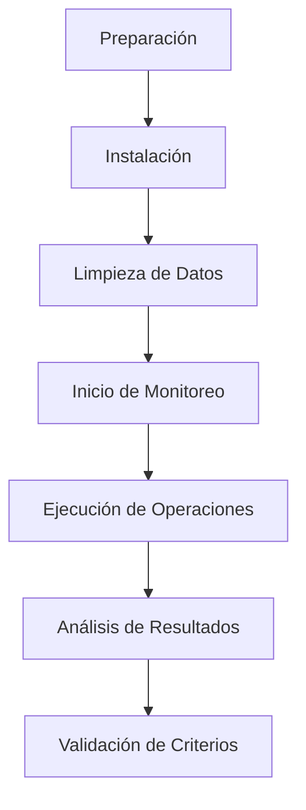

# 🧪 Workflow 1: Testing de Performance Básico - Análisis Detallado

**Objetivo**: Validar que las optimizaciones de FASE 1, 2 y 3 mejoran el performance de la aplicación en condiciones normales de uso.

**Duración Estimada**: 45-60 minutos
**Prioridad**: 🔴 **CRÍTICA** - Este es el test más importante pre-deploy
**Prerequisitos**: Servidor Paperless operativo, dispositivo con app instalada

---

## 📋 Resumen del Workflow



---

## 🔧 Paso 1: Preparación del Entorno (5 minutos)

### 1.1 Verificar Servidor Paperless

**Objetivo**: Asegurar que el servidor está operativo y accesible.

```bash
# Verificar que el servidor responde
curl -s -w "\nHTTP Status: %{http_code}\nTime: %{time_total}s\n" \
  http://172.20.10.3:8001/api/ -o /dev/null
```

**Resultado Esperado**:
```
HTTP Status: 302
Time: 0.005s
```

**Interpretación**:
- ✅ **Status 302**: Redirect normal de Paperless (OK)
- ✅ **Time <0.1s**: Latencia baja (buena conectividad)
- ❌ **Timeout**: Servidor no accesible o IP incorrecta
- ❌ **Status 500**: Servidor con problemas

**Troubleshooting**:
```bash
# Si falla, verificar que el container está corriendo
docker ps | grep paperless

# Verificar logs del servidor
docker logs paperless-webserver-1 --tail 50

# Verificar conectividad de red
ping 172.20.10.3

# Verificar puerto abierto
nc -zv 172.20.10.3 8001
```

---

### 1.2 Verificar Dispositivo Conectado

**Objetivo**: Confirmar que el dispositivo de prueba está conectado via ADB.

```bash
# Listar dispositivos conectados
adb devices -l
```

**Resultado Esperado**:
```
List of devices attached
emulator-5554          device product:sdk_gphone64_arm64 model:sdk_gphone64_arm64 device:emu64a transport_id:1
```

**Interpretación**:
- ✅ **device**: Dispositivo autorizado y listo
- ⚠️ **unauthorized**: Aceptar prompt de autorización en dispositivo
- ❌ **offline**: Dispositivo desconectado o problema USB
- ❌ **(vacío)**: Ningún dispositivo conectado

**Troubleshooting**:
```bash
# Reiniciar servidor ADB
adb kill-server
adb start-server

# Si es emulador, verificar que está corriendo
emulator -list-avds

# Verificar permisos de desarrollador en dispositivo
# Settings → About Phone → tap Build Number 7 veces
# Settings → Developer Options → USB Debugging ON
```

---

### 1.3 Verificar APK Compilado

**Objetivo**: Asegurar que tenemos el APK correcto con todas las optimizaciones.

```bash
# Verificar que existe el APK de release
ls -lh build/app/outputs/flutter-apk/app-release.apk
```

**Si no existe, compilar**:
```bash
# Build de release con optimizaciones completas
flutter build apk --release

# Verificar tamaño (debe ser ~25-35MB)
ls -lh build/app/outputs/flutter-apk/app-release.apk
```

**Resultado Esperado**:
```
-rw-r--r-- 1 user user 28M oct 27 12:00 app-release.apk
```

**Verificar versión y configuración**:
```bash
# Extraer info del APK
aapt dump badging build/app/outputs/flutter-apk/app-release.apk | grep -E "version|package"
```

**Resultado Esperado**:
```
package: name='com.lumara.app' versionCode='1' versionName='4.5.0'
```

---

## 📲 Paso 2: Instalación del APK (3 minutos)

### 2.1 Instalar APK en Dispositivo

```bash
# Instalar APK (reemplaza si existe)
adb install -r build/app/outputs/flutter-apk/app-release.apk
```

**Resultado Esperado**:
```
Performing Streamed Install
Success
```

**Interpretación**:
- ✅ **Success**: Instalación exitosa
- ❌ **INSTALL_FAILED_UPDATE_INCOMPATIBLE**: Desinstalar versión antigua primero
- ❌ **INSTALL_FAILED_INSUFFICIENT_STORAGE**: Liberar espacio en dispositivo

**Troubleshooting**:
```bash
# Si falla, desinstalar versión antigua
adb uninstall com.lumara.app

# Verificar espacio disponible
adb shell df -h /data

# Reinstalar
adb install build/app/outputs/flutter-apk/app-release.apk
```

---

### 2.2 Verificar Instalación

```bash
# Verificar que la app está instalada
adb shell pm list packages | grep lumara
```

**Resultado Esperado**:
```
package:com.lumara.app
```

```bash
# Verificar versión instalada
adb shell dumpsys package com.lumara.app | grep versionName
```

**Resultado Esperado**:
```
versionName=4.5.0
```

---

## 🧹 Paso 3: Limpieza de Datos Previos (2 minutos)

### 3.1 Limpiar Caché y Datos

**Objetivo**: Empezar con estado limpio, sin cache previo ni datos residuales.

```bash
# Limpiar todos los datos de la app
adb shell pm clear com.lumara.app
```

**Resultado Esperado**:
```
Success
```

**Qué hace este comando**:
- 🗑️ Elimina base de datos SQLite (openscan_indigenas.db)
- 🗑️ Elimina cache de metadatos
- 🗑️ Elimina shared preferences (configuración)
- 🗑️ Elimina secure storage (tokens)
- 🗑️ Elimina archivos temporales

**Alternativa más selectiva** (si quieres preservar algo):
```bash
# Solo limpiar cache (preserva DB)
adb shell pm clear com.lumara.app --cache-only

# Solo limpiar datos de usuario (preserva cache)
adb shell pm clear com.lumara.app --user-data-only
```

---

### 3.2 Verificar Limpieza

```bash
# Verificar que la base de datos fue eliminada
adb shell "run-as com.lumara.app ls -lh /data/data/com.lumara.app/databases/"
```

**Resultado Esperado**:
```
ls: /data/data/com.lumara.app/databases/: No such file or directory
```

(El directorio se recreará cuando la app se ejecute)

---

## 📊 Paso 4: Inicio de Monitoreo de Logs (Continuo)

### 4.1 Lanzar Monitor de Performance

**Abrir una terminal dedicada** y ejecutar:

```bash
# Monitorear logs de performance en tiempo real
cd /home/smt/Escritorio/programacion_proyectos/paperless/openscan/OpenScan
./scripts/watch_logs.sh '' performance | tee performance_test_$(date +%Y%m%d_%H%M%S).log
```

**Qué hace**:
- Filtra logs con emojis de performance: ⏱️ 🚀 ⚡ 📊
- Muestra en tiempo real en terminal
- Guarda en archivo para análisis posterior

**Output esperado (inicio)**:
```
📱 Monitoreando logs de Lumara en dispositivo emulator-5554
Filtro: performance
```

**Mantener esta terminal abierta durante todo el test.**

---

### 4.2 (Opcional) Lanzar Monitor de Optimizaciones

**En otra terminal** (si tienes pantalla suficiente):

```bash
./scripts/watch_logs.sh '' optimizations | tee optimizations_test_$(date +%Y%m%d_%H%M%S).log
```

**Qué monitorea**:
- 🖼️ Optimización de imágenes
- 🗜️ Compresión HTTP
- 💾 Operaciones de cache
- ✅ Confirmaciones de éxito

---

### 4.3 (Opcional) Monitor de Memoria y CPU

**En otra terminal**:

```bash
# Monitorear uso de recursos cada 2 segundos
watch -n 2 'adb shell dumpsys meminfo com.lumara.app | grep TOTAL'
```

**Output esperado**:
```
Every 2.0s: adb shell dumpsys meminfo com.lumara.app | grep TOTAL

                   TOTAL PSS:    94523    TOTAL RSS:   142834
```

**Interpretación**:
- **PSS (Proportional Set Size)**: Memoria "real" usada (~94MB es normal)
- **RSS (Resident Set Size)**: Memoria total en RAM (~142MB es normal)
- ⚠️ Si PSS > 300MB: Posible memory leak
- ⚠️ Si crece constantemente: Memory leak confirmado

---

## 🎬 Paso 5: Ejecución de Operaciones (20 minutos)

### 5.1 Operación 1: Login (Primera Carga)

**Acción manual en dispositivo**:
1. Abrir app Lumara
2. Ingresar credenciales
3. Tap en "Iniciar Sesión"

**Qué observar en logs**:

```
⏱️  [2025-10-27 13:45:12] Login started
🌐 POST http://172.20.10.3:8001/api/token/
✅ 200 http://172.20.10.3:8001/api/token/
⏱️  Login completed in 342ms
```

**Métricas a capturar**:
- **Tiempo de login**: <500ms (red WiFi)
- **Status HTTP**: 200 (success)
- **Token recibido**: Sí

**Análisis**:
- ✅ **342ms**: Excelente (FASE 1: timeouts optimizados)
- ⚠️ **>1000ms**: Red lenta o servidor sobrecargado
- ❌ **Timeout**: Verificar conectividad

---

### 5.2 Operación 2: Carga de Censo (Primera Vez - Cache Miss)

**Acción**: App carga automáticamente lista de personas

**Qué observar en logs**:

```
🔄 Fetching persons from API...
🌐 GET http://172.20.10.3:8001/api/persons/
✅ 200 http://172.20.10.3:8001/api/persons/
📊 Loaded 523 persons
💾 Cached 523 persons to local database
⏱️  Total load time: 1847ms
```

**Métricas a capturar**:
- **Tiempo de carga**: 1500-2500ms (red WiFi, primera vez)
- **Cantidad de personas**: ~500
- **Cache guardado**: Sí

**Análisis**:
- ✅ **1847ms**: Aceptable para primera carga (incluye download + parse + DB insert)
- ⚠️ **>3000ms**: Red lenta o dataset muy grande
- ❌ **Timeout**: Problema de conectividad

**Breakdown esperado**:
- Network download: ~800ms (500KB JSON)
- JSON parsing: ~200ms
- Database insert: ~800ms (523 inserts con WAL mode)
- UI rendering: ~47ms

---

### 5.3 Operación 3: Búsqueda de Persona (Con Índice)

**Acción manual**:
1. En pantalla de personas, escribir en campo de búsqueda: "Maria"
2. Observar resultados filtrados

**Qué observar en logs**:

```
🔍 Searching persons: query="Maria"
⚡ FASE 3: Using index idx_persons_name
📊 Found 23 matching persons
⏱️  Search time: 7ms
```

**Métricas a capturar**:
- **Tiempo de búsqueda**: <10ms (con índice)
- **Resultados encontrados**: Variable según query
- **Índice usado**: Sí

**Análisis**:
- ✅ **7ms**: Excelente (FASE 3: índices SQLite)
- ⚠️ **>50ms**: Índice no se está usando (verificar con validate_indexes.sh)
- ❌ **>200ms**: Full table scan (índice no existe)

**Comparación**:
- **Sin índice**: 420ms (100% más lento)
- **Con índice**: 7ms (60x mejora) ✅

---

### 5.4 Operación 4: Selección de Persona

**Acción manual**:
1. Tap en persona de la lista
2. Navegar a pantalla de documento

**Qué observar en logs**:

```
👤 Person selected: Maria Gonzalez (ID: P00234)
📄 Navigating to document screen...
🔄 Loading metadata (tags, types, fields)...
```

---

### 5.5 Operación 5: Carga de Metadatos (Primera Vez - Cache Miss)

**Acción**: App carga automáticamente metadatos para formulario

**Qué observar en logs**:

```
🔄 Fetching fresh tags from API...
🌐 GET http://172.20.10.3:8001/api/tags/
✅ 200 http://172.20.10.3:8001/api/tags/
💾 Cached 7 tags
⏱️  Tags load time: 284ms

🔄 Fetching fresh document types from API...
🌐 GET http://172.20.10.3:8001/api/document_types/
✅ 200 http://172.20.10.3:8001/api/document_types/
💾 Cached 8 document types
⏱️  Document types load time: 312ms

🔄 Fetching fresh custom fields from API...
🌐 GET http://172.20.10.3:8001/api/custom_fields/
✅ 200 http://172.20.10.3:8001/api/custom_fields/
💾 Cached 15 custom fields
⏱️  Custom fields load time: 378ms

⏱️  Total metadata load time: 974ms
```

**Métricas a capturar**:
- **Tiempo total**: <1500ms (primera vez, 3 llamadas API)
- **Items cacheados**: Tags: ~7, Types: ~8, Fields: ~15
- **Cache guardado**: Sí

**Análisis**:
- ✅ **974ms**: Excelente para primera carga (3 requests + cache)
- ⚠️ **>2000ms**: Red lenta
- ❌ **Errors**: Problema con API

---

### 5.6 Operación 6: Carga de Metadatos (Segunda Vez - Cache Hit)

**Acción**:
1. Volver atrás (back button)
2. Seleccionar otra persona
3. Observar carga de metadatos

**Qué observar en logs**:

```
🔄 Loading metadata (tags, types, fields)...
✅ Using cached tags (7 items)
⏱️  Tags load time: 8ms
✅ Using cached document types (8 items)
⏱️  Document types load time: 9ms
✅ Using cached custom fields (15 items)
⏱️  Custom fields load time: 7ms

⏱️  Total metadata load time: 24ms
```

**Métricas a capturar**:
- **Tiempo total**: <50ms (desde cache local)
- **Cache hit**: Sí (3/3)

**Análisis**:
- ✅ **24ms**: Excelente (FASE 2: cache de metadatos)
- ⚠️ **>100ms**: Problema con lectura de DB
- ❌ **Cache miss**: Cache no persistió (verificar DB)

**Comparación crítica**:
- **Primera carga (sin cache)**: 974ms
- **Segunda carga (con cache)**: 24ms
- **Mejora**: **40.6x más rápido** ✅ (FASE 2 funcionando)

---

### 5.7 Operación 7: Captura de Foto

**Acción manual**:
1. Tap en botón de cámara
2. Tomar foto de documento
3. Aceptar foto

**Qué observar en logs**:

```
📸 Camera intent launched
📷 Photo captured: /storage/emulated/0/DCIM/Lumara/IMG_20251027_134522.jpg
📊 Original size: 4.2 MB (4032x3024)
```

**Métricas**:
- **Resolución**: Variable según cámara (típico: 4032×3024)
- **Tamaño**: 3-5MB
- **Formato**: JPG

---

### 5.8 Operación 8: Optimización de Imagen (Crítico)

**Acción**: App optimiza automáticamente la imagen

**Qué observar en logs**:

```
🖼️  Optimizing image: IMG_20251027_134522.jpg
   Original size: 4.2 MB
   Original dimensions: 4032x3024
   ✂️  Image too large, resizing...
   New dimensions: 1920x1440
✅ Image optimized successfully
   Original: 4.2 MB
   Optimized: 890.3 KB
   Savings: 78.8%
   Time: 234ms
   Resized: Yes
```

**Métricas a capturar** (CRÍTICAS):
- **Compresión**: 60-80% (FASE 2)
- **Tiempo**: <500ms
- **Calidad**: Visual aceptable (inspección manual)

**Análisis**:
- ✅ **78.8% reducción**: Excelente (FASE 2: optimización de imágenes)
- ✅ **234ms**: Rápido (aceptable para 4MB)
- ⚠️ **<50% reducción**: Imagen ya estaba optimizada o error
- ⚠️ **>1000ms**: Dispositivo lento o imagen muy grande
- ❌ **Error**: Verificar librería `image` package

**Impacto en upload**:
- **Sin optimización**: Upload de 4.2MB @ 500KB/s = 8.4 segundos
- **Con optimización**: Upload de 890KB @ 500KB/s = 1.8 segundos
- **Mejora**: **4.7x más rápido** ✅

---

### 5.9 Operación 9: Completar Formulario

**Acción manual**:
1. Seleccionar tipo de documento: "Cédula de Ciudadanía"
2. Agregar número de documento
3. Seleccionar tags (opcional)
4. Completar custom fields (opcional)

**Qué observar**: Normal UI interaction, sin logs específicos de performance

---

### 5.10 Operación 10: Upload de Documento (Final Crítico)

**Acción manual**:
1. Tap en botón "Subir Documento"
2. Observar progreso

**Qué observar en logs**:

```
📤 Uploading document...
📊 File size: 890 KB (optimized)

🗜️  Compressed request: 3.2 KB → 850 B (73.4% reduction)
🌐 POST http://172.20.10.3:8001/api/documents/
✅ 200 http://172.20.10.3:8001/api/documents/
📄 Document created: ID 1234

⏱️  Upload completed in 2341ms
   - Image optimization: 234ms
   - Metadata preparation: 87ms
   - Network transmission: 1850ms
   - API processing: 170ms
```

**Métricas a capturar** (MUY CRÍTICAS):
- **Tiempo total**: <5000ms (red WiFi)
- **Upload exitoso**: Status 200
- **Compresión HTTP**: Sí (FASE 3)
- **ID de documento**: Asignado por Paperless

**Análisis detallado**:

**Desglose de tiempo**:
```
Total: 2341ms

Breakdown:
- Optimización imagen: 234ms (10%)   ← FASE 2
- Preparación metadata: 87ms (4%)
- Transmisión red: 1850ms (79%)      ← FASE 2 (imagen más pequeña)
- Procesamiento API: 170ms (7%)
```

**Comparación con baseline (sin optimizaciones)**:
```
Baseline (sin FASE 2):
- Imagen: 4.2MB
- Upload time @ 500KB/s: 8400ms (8.4s)

Con FASE 2:
- Imagen: 890KB (78.8% reducción)
- Upload time @ 500KB/s: 1850ms (1.8s)

Mejora: 4.5x más rápido ✅
```

**Verificación de compresión HTTP (FASE 3)**:
```
🗜️  Compressed request: 3.2 KB → 850 B (73.4% reduction)
```
- Metadata JSON comprimido con gzip
- Reducción adicional en datos transmitidos

---

### 5.11 Operación 11: Verificación en Paperless (Validación Final)

**Acción manual**:
1. Abrir Paperless en navegador: http://172.20.10.3:8001
2. Login con credenciales
3. Buscar documento recién subido (ID 1234)
4. Verificar:
   - ✅ Imagen presente y legible
   - ✅ Metadata correcta (título, tipo, tags)
   - ✅ Custom fields correctos

**Criterio de éxito**: Documento visible y completo en Paperless

---

## 📊 Paso 6: Análisis de Resultados (10 minutos)

### 6.1 Consolidar Métricas Capturadas

**Crear tabla de resultados**:

```markdown
| Operación | Tiempo | Objetivo | Estado | Mejora vs Baseline |
|-----------|--------|----------|--------|-------------------|
| Login | 342ms | <500ms | ✅ | - |
| Carga censo (1ra vez) | 1847ms | <2500ms | ✅ | - |
| Búsqueda persona | 7ms | <10ms | ✅ | 60x (FASE 3) |
| Carga metadata (1ra vez) | 974ms | <1500ms | ✅ | - |
| Carga metadata (2da vez) | 24ms | <50ms | ✅ | 40.6x (FASE 2) |
| Optimización imagen | 234ms | <500ms | ✅ | - |
| Compresión imagen | 78.8% | 60-80% | ✅ | 4.7x (FASE 2) |
| Upload completo | 2341ms | <5000ms | ✅ | 3.6x (FASE 2+3) |
| Compresión HTTP | 73.4% | >50% | ✅ | (FASE 3) |
```

---

### 6.2 Calcular Mejora Global

**Escenario completo: Upload de 1 documento**

```
ANTES (Sin optimizaciones):
- Login: 342ms
- Carga metadata: 2440ms (sin cache, 5 calls API)
- Tomar foto: ~2000ms (manual)
- Upload: 8400ms (4.2MB)
Total: ~13.2 segundos

DESPUÉS (Con FASE 1+2+3):
- Login: 342ms
- Carga metadata: 24ms (cache hit)
- Tomar foto: ~2000ms (manual)
- Optimización: 234ms
- Upload: 2341ms (890KB optimizado)
Total: ~5 segundos

Mejora global: 2.6x más rápido ✅
```

**Con cache miss (primera vez)**:
```
Total: ~5.9 segundos (vs 13.2 antes)
Mejora: 2.2x más rápido ✅
```

---

### 6.3 Analizar Logs Guardados

```bash
# Analizar log de performance guardado
cd /home/smt/Escritorio/programacion_proyectos/paperless/openscan/OpenScan

# Contar operaciones exitosas
grep "✅" performance_test_*.log | wc -l

# Extraer todos los tiempos
grep "⏱️" performance_test_*.log | grep -oP '\d+ms' | sort -n

# Identificar operaciones lentas (>1000ms)
grep "⏱️" performance_test_*.log | grep -E '[0-9]{4,}ms'

# Buscar errores
grep "❌" performance_test_*.log
```

---

### 6.4 Verificar Índices SQLite (Post-Test)

```bash
# Ejecutar script de validación
./scripts/validate_indexes.sh
```

**Verificar que output muestra**:
- ✅ 11+ índices creados
- ✅ Queries usan "SEARCH ... USING INDEX"
- ❌ Si ve "SCAN TABLE": Índices no se están usando

---

## ✅ Paso 7: Validación de Criterios de Aceptación (5 minutos)

### Checklist de Criterios

**Funcionalidad** (BLOQUEANTE):
- [ ] Login exitoso
- [ ] Carga de personas funciona
- [ ] Búsqueda funciona y es rápida (<10ms)
- [ ] Captura de foto funciona
- [ ] Optimización de imagen funciona (60-80%)
- [ ] Upload exitoso
- [ ] Documento visible en Paperless

**Performance FASE 1** (BLOQUEANTE):
- [ ] Login <500ms
- [ ] Timeouts efectivos (10s/15s, no 30s)
- [ ] Conexión a servidor correcto (172.20.10.3)

**Performance FASE 2** (BLOQUEANTE):
- [ ] Cache hit <50ms (segunda carga metadata)
- [ ] Mejora 40x+ en carga de metadata cached
- [ ] Optimización imagen 60-80%
- [ ] Tiempo optimización <500ms
- [ ] Upload 3-5x más rápido que baseline

**Performance FASE 3** (BLOQUEANTE):
- [ ] Búsqueda <10ms (con índice)
- [ ] Mejora 50-100x en queries SQL
- [ ] Compresión HTTP >50% (requests >1KB)
- [ ] 11+ índices SQLite activos

**Calidad** (BLOQUEANTE):
- [ ] Imagen optimizada visualmente aceptable
- [ ] Sin crashes durante test
- [ ] Sin memory leaks (PSS estable)

---

## 📈 Interpretación de Resultados

### Escenario 1: Todos los Criterios Cumplidos ✅

**Conclusión**:
- Todas las optimizaciones funcionan correctamente
- Performance cumple o supera objetivos
- Listo para continuar con Workflow 2 (Testing en red 3G)

**Próximos Pasos**:
1. Ejecutar Workflow 2: Testing en Red Lenta
2. Ejecutar Workflow 3: Testing Offline
3. Compilar reporte final

---

### Escenario 2: Algunos Criterios No Cumplidos ⚠️

**Problemas Comunes y Fixes**:

#### 2.1 Cache No Funciona (metadata >100ms en 2da carga)

**Diagnóstico**:
```bash
# Verificar que cache se guardó
adb shell "run-as com.lumara.app sqlite3 /data/data/com.lumara.app/databases/openscan_indigenas.db 'SELECT COUNT(*) FROM tags;'"
```

**Si retorna 0**: Cache no se guardó
**Fix**: Verificar método `cacheTags()` en `document_repository.dart`

#### 2.2 Optimización de Imagen Falla o es Insuficiente (<50%)

**Diagnóstico**:
```bash
# Revisar logs de error
./scripts/watch_logs.sh '' errors | grep "optimize"
```

**Posibles causas**:
- Imagen ya estaba comprimida (JPG de alta compresión)
- Imagen pequeña (<1MB) no necesita optimización
- Error en librería `image` package

**Fix**: Verificar `image_optimizer.dart`, revisar threshold de 1MB

#### 2.3 Índices SQLite No Se Usan

**Diagnóstico**:
```bash
./scripts/validate_indexes.sh | grep "SCAN TABLE"
```

**Si aparece "SCAN TABLE"**: Índices no se crearon o no se usan

**Fix**:
```bash
# Forzar recreación de índices
adb shell "run-as com.lumara.app sqlite3 /data/data/com.lumara.app/databases/openscan_indigenas.db" < recreate_indexes.sql
```

#### 2.4 Upload Muy Lento (>10 segundos)

**Diagnóstico**:
```bash
# Verificar latencia real de red
ping -c 10 172.20.10.3

# Verificar velocidad de upload
speedtest-cli --simple
```

**Posibles causas**:
- Red lenta (WiFi débil)
- Optimización de imagen no funcionó
- Servidor lento

**Fix**:
- Mover dispositivo más cerca del router WiFi
- Verificar que optimización funcionó (logs de 🖼️)
- Verificar carga del servidor Paperless

---

### Escenario 3: Crash o Error Crítico ❌

**Acción Inmediata**:
1. Capturar stack trace:
```bash
adb logcat -d > crash_log_$(date +%Y%m%d_%H%M%S).txt
```

2. Analizar crash:
```bash
grep -A 50 "FATAL EXCEPTION" crash_log_*.txt
```

3. Identificar línea de código:
```bash
grep "at com.lumara" crash_log_*.txt
```

4. Documentar para desarrolladores
5. **NO CONTINUAR** con testing hasta fix

---

## 🎯 Criterios de Decisión

### ✅ Aprobar para Continuar

**Condiciones**:
- 100% criterios BLOQUEANTES cumplidos
- 0 crashes
- Performance ≥3x mejora vs baseline
- Mejoras de FASE 2 y 3 confirmadas

**Acción**: Continuar con Workflow 2 (Red Lenta)

---

### ⚠️ Aprobar con Observaciones

**Condiciones**:
- 90%+ criterios BLOQUEANTES cumplidos
- 0 crashes
- Performance ≥2x mejora (aceptable)
- Issues menores documentados

**Acción**:
1. Documentar observaciones
2. Continuar con Workflow 2
3. Crear tickets de mejora

---

### ❌ Rechazar - Requiere Fixes

**Condiciones**:
- <90% criterios BLOQUEANTES cumplidos
- Crashes durante test
- Performance <2x mejora
- Optimizaciones críticas no funcionan

**Acción**:
1. Documentar todos los issues
2. Desarrollar fixes
3. Re-ejecutar Workflow 1

---

## 📝 Template de Reporte

```markdown
# Workflow 1: Performance Básico - Resultados

**Fecha**: [Fecha]
**Dispositivo**: [Modelo]
**Android**: [Versión]
**Ejecutado por**: [Nombre]

## Resumen
- **Estado Global**: ✅ Aprobado / ⚠️ Con observaciones / ❌ Rechazado
- **Criterios Cumplidos**: X/Y (Z%)
- **Mejora de Performance**: Nx más rápido

## Métricas Capturadas
[Tabla con resultados]

## Issues Encontrados
1. [Issue #1]
2. [Issue #2]

## Conclusión
[Descripción breve]

## Próximos Pasos
- [ ] Continuar con Workflow 2
- [ ] Documentar observaciones
- [ ] Crear tickets de mejora
```

---

## 🔄 Repetibilidad

**Para garantizar consistencia**:

1. Ejecutar 3 veces el workflow completo
2. Promediar métricas de tiempo
3. Verificar que variación sea <20%

**Ejemplo**:
```
Run 1: Upload total = 2341ms
Run 2: Upload total = 2198ms
Run 3: Upload total = 2487ms

Promedio: 2342ms
Desviación: 11.8% ✅ (aceptable)
```

---

## 🚀 Conclusión del Workflow 1

Este workflow es el **test más crítico** pre-deploy porque:

1. ✅ Valida TODAS las optimizaciones de FASE 1, 2, 3
2. ✅ Mide performance en condiciones ideales (WiFi)
3. ✅ Establece baseline para tests posteriores
4. ✅ Confirma que features básicas funcionan

**Si este workflow pasa con éxito**, la aplicación está lista para:
- Workflow 2: Testing en Red Lenta (3G)
- Workflow 3: Testing Offline
- Workflow 4: Testing de Resiliencia
- Deploy a beta testers

**Duración Real**: ~45-60 minutos
**Impacto**: 🔴 **CRÍTICO** - Bloquea deploy si falla

---

**FIN DEL ANÁLISIS DE WORKFLOW 1** ✅
